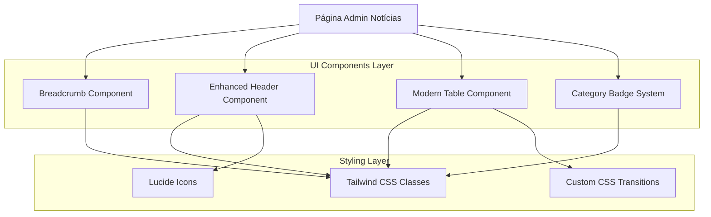

# Arquitetura Técnica - Melhorias Admin Notícias

## 1. Arquitetura de Design



## 2. Descrição da Tecnologia
- Frontend: React@18 + TypeScript + Tailwind CSS@3
- Ícones: Lucide React
- Animações: CSS Transitions nativas
- Estilização: Tailwind CSS com classes customizadas

## 3. Definições de Componentes

| Componente | Propósito |
|------------|-----------|
| Breadcrumb | Navegação contextual "Admin / Notícias / Lista" |
| EnhancedButton | Botão "Nova Notícia" com ícone PlusCircle e estilo moderno |
| ModernTable | Tabela com hover effects e design alternado |
| CategoryBadge | Sistema de badges coloridas por categoria |

## 4. Estrutura de Componentes

### 4.1 Breadcrumb Component
```typescript
interface BreadcrumbProps {
  items: Array<{
    label: string;
    href?: string;
  }>;
}
```

### 4.2 Enhanced Button Component
```typescript
interface EnhancedButtonProps {
  onClick: () => void;
  icon?: React.ComponentType;
  children: React.ReactNode;
  variant?: 'primary' | 'secondary';
}
```

### 4.3 Category Badge Component
```typescript
interface CategoryBadgeProps {
  category: 'politica' | 'esportes' | 'saude' | 'destaque';
  label: string;
  showIcon?: boolean;
}
```

## 5. Implementação de Estilos

### 5.1 Classes Tailwind Customizadas
```css
/* Hover effects para tabela */
.table-row-hover:hover {
  @apply bg-gray-50 transition-colors duration-200;
}

/* Badges por categoria */
.badge-politica {
  @apply bg-blue-500 text-white px-2 py-1 rounded-full text-xs font-medium;
}

.badge-esportes {
  @apply bg-green-500 text-white px-2 py-1 rounded-full text-xs font-medium;
}

.badge-saude {
  @apply bg-purple-500 text-white px-2 py-1 rounded-full text-xs font-medium;
}

.badge-destaque {
  @apply bg-yellow-500 text-white px-2 py-1 rounded-full text-xs font-medium;
}
```

### 5.2 Estrutura de Arquivos
```
pages/admin/noticias.tsx (arquivo principal)
├── Breadcrumb inline component
├── Enhanced header section
├── Modern table implementation
└── Category badge system

components/admin/ (componentes reutilizáveis)
├── Breadcrumb.tsx
├── EnhancedButton.tsx
└── CategoryBadge.tsx
```

## 6. Modelo de Dados

### 6.1 Interface de Categoria
```typescript
interface CategoryConfig {
  politica: {
    color: 'blue';
    bgClass: 'bg-blue-500';
    textClass: 'text-white';
  };
  esportes: {
    color: 'green';
    bgClass: 'bg-green-500';
    textClass: 'text-white';
  };
  saude: {
    color: 'purple';
    bgClass: 'bg-purple-500';
    textClass: 'text-white';
  };
  destaque: {
    color: 'yellow';
    bgClass: 'bg-yellow-500';
    textClass: 'text-white';
    icon: '⭐';
  };
}
```

### 6.2 Configuração de Breadcrumb
```typescript
const breadcrumbItems = [
  { label: 'Admin', href: '/admin' },
  { label: 'Notícias', href: '/admin/noticias' },
  { label: 'Lista' }
];
```