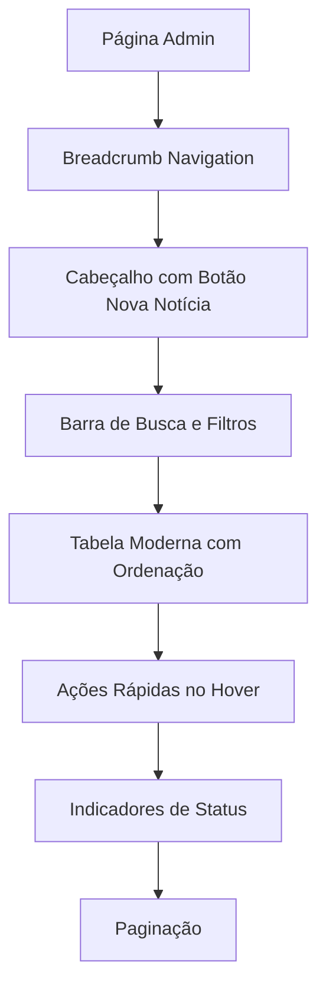
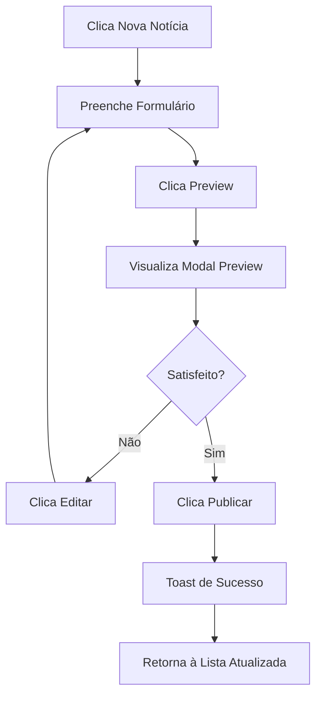

# Melhorias Visuais - Página Admin de Notícias

## 1. Visão Geral do Projeto
Modernização da interface da página de administração de notícias com foco em melhorar a experiência do usuário através de elementos visuais mais claros, navegação intuitiva e design responsivo.

## 2. Funcionalidades Principais

### 2.1 Módulos de Funcionalidade
As melhorias consistem nos seguintes módulos principais:

#### Melhorias Visuais (UI Design)
1. **Sistema de Navegação**: breadcrumb para orientação do usuário
2. **Cabeçalho Aprimorado**: botão de nova notícia com design moderno
3. **Layout de Listagem**: tabela moderna com hover effects
4. **Sistema de Etiquetas**: badges coloridas por categoria

#### Melhorias Funcionais (UX / Painel Admin)
5. **Sistema de Busca e Filtros**: busca por título e filtros rápidos
6. **Ordenação Interativa**: ordenação clicável por colunas
7. **Paginação**: sistema de páginas para grandes volumes
8. **Ações Rápidas**: botões de ação com hover reveal
9. **Indicadores de Status**: visualização do estado de publicação

### 2.2 Detalhes das Páginas

| Página | Módulo | Descrição da Funcionalidade |
|--------|--------|----------------------------|
| Admin Notícias | Breadcrumb | Exibir navegação "Admin / Notícias / Lista" para orientação do usuário |
| Admin Notícias | Cabeçalho | Botão "Nova Notícia" com ícone PlusCircle, posicionado no canto superior direito |
| Admin Notícias | Barra de Busca | Campo de busca por título com ícone de lupa e placeholder |
| Admin Notícias | Filtros Rápidos | Dropdowns para categoria, status (Destaque/Normal) e seletor de data |
| Admin Notícias | Tabela de Listagem | Design moderno com linhas alternadas, efeito hover e cabeçalhos clicáveis |
| Admin Notícias | Sistema de Badges | Etiquetas coloridas por categoria com cores consistentes |
| Admin Notícias | Ações Rápidas | Botões de editar, excluir, destacar e visualizar que aparecem no hover |
| Admin Notícias | Indicador de Status | Ícone ou badge para mostrar se a notícia está publicada ou em rascunho |
| Admin Notícias | Paginação | Controles de navegação entre páginas (10 itens por página) |

## 3. Processo Principal
O usuário navega pela interface aprimorada seguindo este fluxo:

### 3.1 Fluxo de Navegação Visual
1. Visualiza o breadcrumb para entender sua localização
2. Utiliza o botão "Nova Notícia" estilizado para criar conteúdo
3. Navega pela tabela moderna com feedback visual
4. Identifica categorias através das badges coloridas

### 3.2 Fluxo de Funcionalidades UX
1. Utiliza a barra de busca para encontrar notícias específicas
2. Aplica filtros rápidos por categoria, status ou data
3. Ordena resultados clicando nos cabeçalhos da tabela
4. Utiliza ações rápidas (editar, excluir, destacar, visualizar) no hover
5. Navega entre páginas quando há muitas notícias
6. Identifica status de publicação através dos indicadores visuais



## 4. Design da Interface

### 4.1 Estilo de Design
- **Cores primárias**: 
  - Política: Azul (#3B82F6)
  - Esportes: Verde (#10B981)
  - Saúde: Roxo (#8B5CF6)
  - Destaque: Dourado (#F59E0B) com ícone ⭐
- **Estilo de botões**: Modernos com sombras suaves e ícones Lucide
- **Fonte**: Sistema padrão com tamanhos hierárquicos
- **Layout**: Design limpo com espaçamento adequado
- **Ícones**: Lucide React para consistência visual

### 4.2 Visão Geral do Design das Páginas

| Página | Módulo | Elementos UI |
|--------|--------|-------------|
| Admin Notícias | Breadcrumb | Navegação em texto com separadores "/" em cor suave |
| Admin Notícias | Botão Nova Notícia | Ícone PlusCircle, fundo azul, sombra sutil, hover effect |
| Admin Notícias | Barra de Busca | Input com ícone Search, placeholder "Buscar por título...", borda focus azul |
| Admin Notícias | Filtros | Dropdowns estilizados com ícones Filter, ChevronDown, cores suaves |
| Admin Notícias | Tabela | Linhas alternadas (#f9fafb), hover highlight, cabeçalhos clicáveis com ícones de ordenação |
| Admin Notícias | Badges | Cores específicas por categoria, bordas arredondadas, ícone estrela para destaque |
| Admin Notícias | Ações Rápidas | Ícones Edit, Trash2, Star, Eye que aparecem no hover com tooltips |
| Admin Notícias | Status Indicator | Badge verde (Publicado) ou amarelo (Rascunho) com ícones CheckCircle/Clock |
| Admin Notícias | Paginação | Botões Previous/Next, números de página, info "Mostrando X de Y" |

### 4.3 Responsividade
- Design desktop-first com adaptação para tablets
- Tabela responsiva com scroll horizontal em telas menores
- Botões e badges mantêm proporções adequadas em diferentes resoluções

## 5. Especificações Técnicas

### 5.1 Componentes a Implementar

#### Componentes Visuais
- **Breadcrumb Component**: Navegação contextual
- **Enhanced Button**: Botão com ícone e estilo moderno
- **Modern Table**: Tabela com hover effects e design alternado
- **Category Badges**: Sistema de etiquetas coloridas

#### Componentes Funcionais
- **Search Bar**: Campo de busca com debounce
- **Filter Dropdowns**: Seletores para categoria, status e data
- **Sortable Headers**: Cabeçalhos clicáveis com indicadores de ordenação
- **Action Buttons**: Botões de ação que aparecem no hover
- **Status Indicators**: Badges de status de publicação
- **Pagination Component**: Controles de navegação entre páginas

### 5.2 Estilos CSS Principais
```css
/* Hover effect para tabela */
tr:hover { 
  background-color: #f9fafb; 
  transition: 0.2s; 
}

/* Cores das badges */
.badge-politica { background-color: #3B82F6; }
.badge-esportes { background-color: #10B981; }
.badge-saude { background-color: #8B5CF6; }
.badge-destaque { background-color: #F59E0B; }
```

### 5.3 Ícones Utilizados

#### Ícones de Interface
- **PlusCircle** (Lucide): Botão Nova Notícia
- **Star** (⭐): Badge de destaque
- **ChevronRight** (Lucide): Separadores do breadcrumb
- **Search** (Lucide): Ícone da barra de busca
- **Filter** (Lucide): Ícone dos filtros
- **ChevronDown** (Lucide): Dropdowns

#### Ícones de Ações
- **Edit** (Lucide): ✏️ Editar notícia
- **Trash2** (Lucide): 🗑️ Excluir notícia
- **Star** (Lucide): ⭐ Tornar destaque
- **Eye** (Lucide): 👁️ Visualizar no site

#### Ícones de Status e Ordenação
- **CheckCircle** (Lucide): Notícia publicada
- **Clock** (Lucide): Notícia em rascunho
- **ArrowUp/ArrowDown** (Lucide): Indicadores de ordenação
- **ChevronLeft/ChevronRight** (Lucide): Navegação da paginação

## 6. Especificações Funcionais UX

### 6.1 Sistema de Busca e Filtros
- **Busca por Título**: Campo de input com debounce de 300ms para otimizar performance
- **Filtro por Categoria**: Dropdown com todas as categorias disponíveis + opção "Todas"
- **Filtro por Status**: Dropdown com opções "Todos", "Destaque", "Normal"
- **Filtro por Data**: Seletor de intervalo de datas (data inicial e final)

### 6.2 Ordenação Interativa
- **Colunas Ordenáveis**: Título, Categoria, Data de Criação
- **Indicadores Visuais**: Setas para mostrar direção da ordenação (crescente/decrescente)
- **Estado Padrão**: Ordenação por data de criação (mais recente primeiro)

### 6.3 Sistema de Paginação
- **Itens por Página**: 10 notícias por página (configurável)
- **Controles**: Botões Anterior/Próximo + números de página
- **Informações**: "Mostrando X-Y de Z resultados"
- **Navegação Rápida**: Pular para primeira/última página

### 6.4 Ações Rápidas com Hover
- **Trigger**: Ações aparecem ao passar mouse sobre a linha da tabela
- **Ações Disponíveis**:
  - ✏️ **Editar**: Abre formulário de edição
  - 🗑️ **Excluir**: Modal de confirmação antes da exclusão
  - ⭐ **Destacar**: Toggle do status de destaque
  - 👁️ **Visualizar**: Abre notícia em nova aba no site público
- **Tooltips**: Cada ação tem tooltip explicativo

### 6.5 Indicadores de Status de Publicação
- **Status Publicado**: Badge verde com ícone CheckCircle
- **Status Rascunho**: Badge amarelo com ícone Clock
- **Posicionamento**: Coluna dedicada na tabela
- **Interatividade**: Clique no status permite alternar entre publicado/rascunho

## 7. Melhorias de Usabilidade Avançadas

### 7.1 Sistema de Feedback Visual (Toast Notifications)
- **Notificações de Sucesso**: Toast verde com ícone CheckCircle
  - "✅ Notícia criada com sucesso"
  - "✅ Notícia atualizada com sucesso"
  - "✅ Notícia destacada com sucesso"
- **Notificações de Erro**: Toast vermelho com ícone AlertCircle
  - "❌ Erro ao salvar notícia"
  - "❌ Erro ao excluir notícia"
- **Notificações de Confirmação**: Toast azul com ícone Info
  - "🗑️ Notícia excluída permanentemente"
- **Posicionamento**: Canto superior direito da tela
- **Duração**: 4 segundos com opção de fechar manualmente
- **Animação**: Slide-in suave com fade-out

### 7.2 Sistema de Pré-visualização da Notícia
- **Botão Preview**: Ícone Eye na lista de ações rápidas
- **Modal de Preview**: Janela modal que simula o layout do site público
- **Conteúdo do Preview**:
  - Título da notícia formatado
  - Imagem de destaque (se houver)
  - Conteúdo completo com formatação
  - Data de publicação
  - Categoria com badge colorida
- **Funcionalidades**:
  - Preview em tempo real durante edição
  - Botão "Publicar" direto do preview
  - Botão "Editar" para voltar ao formulário
- **Responsividade**: Preview adapta-se ao tamanho da tela

### 7.3 Sistema de Data Amigável
- **Formato Híbrido**: Data completa + tempo relativo
  - Exemplo: "28/09/2025 (há 2 semanas)"
  - Exemplo: "15/01/2025 (há 3 dias)"
  - Exemplo: "hoje às 14:30"
- **Biblioteca**: date-fns para formatação precisa
- **Atualização**: Tempo relativo atualiza automaticamente
- **Tooltip**: Hover mostra data/hora completa
- **Localização**: Português brasileiro

### 7.4 Painel de Estatísticas Rápidas
- **Posicionamento**: Acima da lista de notícias, abaixo dos filtros
- **Layout**: 3 cards horizontais com ícones e números
- **Cards de Estatísticas**:
  
  **📰 Total de Notícias**
  - Contador total de notícias no sistema
  - Ícone: Newspaper (Lucide)
  - Cor: Azul (#3B82F6)
  
  **⭐ Notícias em Destaque**
  - Contador de notícias marcadas como destaque
  - Ícone: Star (Lucide)
  - Cor: Dourado (#F59E0B)
  
  **📅 Publicadas Este Mês**
  - Contador de notícias publicadas no mês atual
  - Ícone: Calendar (Lucide)
  - Cor: Verde (#10B981)

- **Design dos Cards**:
  - Fundo branco com sombra sutil
  - Bordas arredondadas
  - Ícone grande à esquerda
  - Número em destaque
  - Texto descritivo
  - Hover effect com elevação

### 7.5 Componentes Adicionais a Implementar

#### Sistema de Toast
- **ToastProvider**: Context para gerenciar notificações
- **Toast Component**: Componente individual de notificação
- **useToast Hook**: Hook para disparar notificações

#### Modal de Preview
- **PreviewModal Component**: Modal responsivo para preview
- **NewsPreview Component**: Renderização da notícia no estilo do site
- **PreviewButton Component**: Botão de ação para abrir preview

#### Formatação de Data
- **DateFormatter Utility**: Função para formatar datas amigáveis
- **RelativeTime Component**: Componente para exibir tempo relativo
- **DateTooltip Component**: Tooltip com data completa

#### Painel de Estatísticas
- **StatsPanel Component**: Container dos cards de estatísticas
- **StatCard Component**: Card individual de estatística
- **useStats Hook**: Hook para calcular estatísticas em tempo real

### 7.6 Especificações Técnicas das Melhorias

#### Dependências Adicionais
```json
{
  "date-fns": "^2.30.0",
  "react-hot-toast": "^2.4.1"
}
```

#### Ícones Adicionais (Lucide React)
- **CheckCircle**: Sucesso nos toasts
- **AlertCircle**: Erro nos toasts
- **Info**: Informação nos toasts
- **Eye**: Botão de preview
- **Newspaper**: Estatística total
- **Calendar**: Estatística mensal

#### Cores do Sistema de Toast
```css
.toast-success { background: #10B981; color: white; }
.toast-error { background: #EF4444; color: white; }
.toast-info { background: #3B82F6; color: white; }
```

#### Layout dos Cards de Estatística
```css
.stat-card {
  background: white;
  border-radius: 8px;
  box-shadow: 0 1px 3px rgba(0,0,0,0.1);
  padding: 1.5rem;
  display: flex;
  align-items: center;
  gap: 1rem;
  transition: transform 0.2s;
}

.stat-card:hover {
  transform: translateY(-2px);
  box-shadow: 0 4px 12px rgba(0,0,0,0.15);
}
```

## 8. Fluxo de Experiência do Usuário Completo

### 8.1 Jornada do Administrador
1. **Entrada**: Visualiza painel de estatísticas para contexto geral
2. **Navegação**: Usa breadcrumb para orientação
3. **Busca/Filtro**: Encontra notícias específicas rapidamente
4. **Ação**: Utiliza ações rápidas no hover
5. **Feedback**: Recebe confirmação visual via toast
6. **Preview**: Visualiza resultado antes de publicar
7. **Gestão**: Navega entre páginas com paginação eficiente

### 8.2 Fluxo de Criação/Edição


Essas melhorias de usabilidade transformam o painel admin em uma ferramenta moderna, intuitiva e eficiente, proporcionando uma experiência excepcional para os administradores do sistema.