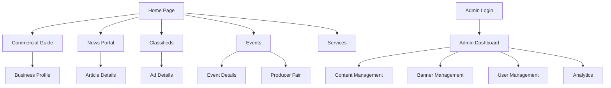

# PRD - Portal Maria Helena
## Product Requirements Document

---

## 1. Product Overview

O Portal Maria Helena é uma plataforma digital municipal que conecta pessoas, negócios e oportunidades na cidade de Maria Helena - PR. O portal serve como hub central de informações, promovendo o desenvolvimento econômico local através de um ecossistema digital integrado que facilita a descoberta de serviços, eventos e oportunidades comerciais.

**Missão:** Fortalecer a economia local e melhorar a qualidade de vida dos cidadãos através de uma plataforma digital que conecta a comunidade com negócios, serviços e informações relevantes.

**Visão:** Ser a principal referência digital para moradores, visitantes e empresários que buscam informações e oportunidades em Maria Helena.

**Valor de Mercado:** Estimativa de impacto econômico de R$ 2-5 milhões anuais através do aumento da visibilidade de negócios locais e facilitação de transações comerciais.

## 2. Core Features

### 2.1 User Roles

| Role | Registration Method | Core Permissions |
|------|---------------------|------------------|
| Visitante | Acesso livre | Navegação, visualização de conteúdo público, busca |
| Usuário Cadastrado | Email + senha | Publicação de classificados, contato com empresas, área pessoal |
| Empresário | Cadastro empresarial | Gestão de perfil empresarial, publicação de conteúdo promocional |
| Administrador | Convite interno | Gestão completa do portal, moderação de conteúdo, analytics |

### 2.2 Feature Module

O Portal Maria Helena consiste nas seguintes páginas principais:

1. **Home Page**: hero banner carousel, navegação principal, destaques de notícias, empresas em destaque, classificados recentes, serviços úteis, previsão do tempo
2. **Guia Comercial**: diretório de empresas, filtros por categoria, perfis detalhados, sistema de busca avançada
3. **Portal de Notícias**: artigos locais, categorização, sistema de destaque, gestão editorial
4. **Classificados**: anúncios categorizados, sistema de busca, gestão de anúncios pessoais
5. **Eventos**: calendário municipal, detalhes de eventos, feira do produtor, integração com agenda local
6. **Serviços Municipais**: telefones úteis, transporte público, informações de utilidade pública
7. **Área Administrativa**: dashboard, gestão de conteúdo, sistema de banners, temas sazonais
8. **Páginas Institucionais**: sobre, contato, termos de uso, política de privacidade

### 2.3 Page Details

| Page Name | Module Name | Feature description |
|-----------|-------------|---------------------|
| Home Page | Hero Banner Carousel | Display rotating promotional banners with automatic transitions, click-through tracking |
| Home Page | News Highlights | Show featured news article prominently, display recent news grid, category filtering |
| Home Page | Business Showcase | Carousel of featured businesses, quick access to business categories |
| Home Page | Featured Classifieds | Display recent classified ads with images, prices, and quick contact |
| Home Page | Useful Services | Quick access to municipal services, weather widget, emergency contacts |
| Commercial Guide | Business Directory | Complete business listings with categories, search and filter functionality |
| Commercial Guide | Business Profiles | Detailed business pages with contact info, images, descriptions, location maps |
| Commercial Guide | Category Navigation | Organized business categories (restaurants, services, commerce, health, education) |
| News Portal | Article Management | Full article creation, editing, categorization, featured article system |
| News Portal | Content Display | Responsive article layout, image galleries, social sharing |
| Classifieds | Ad Management | User-generated classified ads with images, pricing, contact information |
| Classifieds | Search & Filter | Advanced search by category, price range, location, date |
| Events | Event Calendar | Municipal event listings, date-based organization, detailed event pages |
| Events | Producer Fair | Dedicated section for local producer fair with vendor profiles |
| Services | Municipal Info | Useful phone numbers, public transport schedules, emergency services |
| Services | Weather Integration | Real-time weather information and forecasts |
| Admin Panel | Content Management | Complete CRUD operations for all content types |
| Admin Panel | Banner System | Dynamic banner management with positioning and scheduling |
| Admin Panel | User Management | User roles, permissions, content moderation |
| Admin Panel | Analytics Dashboard | Site statistics, user engagement metrics, content performance |
| Admin Panel | Seasonal Themes | Visual theme management for holidays and special occasions |

## 3. Core Process

### Regular User Flow
1. **Discovery**: User visits homepage → browses featured content → explores categories
2. **Search**: Uses search functionality → applies filters → views results
3. **Engagement**: Views business/event details → contacts via provided information → potential transaction
4. **Community**: Publishes classified ads → interacts with local content → returns for updates

### Business Owner Flow
1. **Registration**: Creates business account → verifies information → sets up profile
2. **Profile Management**: Adds business details → uploads images → manages contact information
3. **Promotion**: Requests featured placement → utilizes banner advertising → tracks engagement
4. **Maintenance**: Updates information regularly → responds to inquiries → monitors visibility

### Administrator Flow
1. **Content Moderation**: Reviews submitted content → approves/rejects submissions → maintains quality standards
2. **Site Management**: Updates news articles → manages events → configures banners
3. **Analytics**: Monitors site performance → tracks user engagement → generates reports
4. **System Maintenance**: Manages user accounts → updates site themes → ensures security

## 4. User Interface Design

### 4.1 Design Style

**Color Palette:**
- Primary: Indigo (#4F46E5) - Professional and trustworthy
- Secondary: Orange (#F97316) - Warm and inviting, represents local community
- Accent: Purple (#7C3AED) - Modern and dynamic
- Neutral: Gray scale (#F9FAFB to #111827) - Clean and readable

**Typography:**
- Primary Font: Inter (modern, highly readable)
- Headings: Bold weights (600-700)
- Body Text: Regular weight (400)
- Font Sizes: 14px (small), 16px (body), 18px (large), 24px+ (headings)

**Button Style:**
- Rounded corners (8px border-radius)
- Solid primary buttons with hover effects
- Outline secondary buttons
- Consistent padding (12px vertical, 24px horizontal)

**Layout Style:**
- Card-based design for content organization
- Top navigation with sticky header
- Responsive grid system (1-6 columns based on screen size)
- Generous white space for readability

**Icons & Visual Elements:**
- Font Awesome icons for consistency
- Subtle shadows and gradients
- Hover animations and transitions
- Professional photography for business listings

### 4.2 Page Design Overview

| Page Name | Module Name | UI Elements |
|-----------|-------------|-------------|
| Home Page | Hero Section | Full-width carousel with overlay text, call-to-action buttons, automatic transitions |
| Home Page | News Grid | Card layout with featured article (2/3 width), sidebar recent news, category tags |
| Home Page | Business Carousel | Horizontal scrolling cards with business logos, names, ratings |
| Commercial Guide | Business Grid | Responsive card grid, filter sidebar, search bar, pagination |
| Commercial Guide | Business Profile | Hero image, contact card, description, gallery, map integration |
| News Portal | Article Layout | Full-width header image, typography-focused content, social sharing |
| Classifieds | Ad Grid | Image thumbnails, price highlights, category badges, quick contact |
| Events | Calendar View | Month/list view toggle, event cards with date prominence, filter options |
| Admin Panel | Dashboard | Statistics cards, quick action buttons, recent activity feed |
| Admin Panel | Forms | Clean form layouts, image upload areas, rich text editors |

### 4.3 Responsiveness

**Mobile-First Approach:**
- Responsive design optimized for mobile devices (320px+)
- Touch-friendly interface with appropriate button sizes (44px minimum)
- Collapsible navigation menu for mobile
- Optimized image loading and performance

**Breakpoints:**
- Mobile: 320px - 768px
- Tablet: 768px - 1024px  
- Desktop: 1024px+

**Touch Optimization:**
- Swipe gestures for carousels
- Touch-friendly form inputs
- Optimized tap targets
- Smooth scrolling and transitions

## 5. Technical Requirements

### 5.1 Architecture Overview

**Frontend Stack:**
- Next.js 13+ with App Router
- TypeScript for type safety
- Tailwind CSS for styling
- React Hook Form for form management

**Backend & Database:**
- Supabase (PostgreSQL) for database and authentication
- Real-time subscriptions for live updates
- Row Level Security (RLS) for data protection

**Infrastructure:**
- Vercel for hosting and deployment
- CDN for image optimization
- SSL encryption for security

### 5.2 Performance Requirements

**Loading Performance:**
- Initial page load: < 3 seconds
- Subsequent navigation: < 1 second
- Image optimization with Next.js Image component
- Static generation (SSG) for public pages

**SEO Requirements:**
- Server-side rendering for all public pages
- Structured data markup for businesses and events
- Meta tags optimization
- Sitemap generation
- Google Analytics integration

**Accessibility:**
- WCAG 2.1 AA compliance
- Keyboard navigation support
- Screen reader compatibility
- Alt text for all images

### 5.3 Security Requirements

**Authentication:**
- Supabase Auth with email/password
- Session management with secure tokens
- Role-based access control (RBAC)

**Data Protection:**
- LGPD compliance for Brazilian users
- Secure data transmission (HTTPS)
- Input validation and sanitization
- SQL injection prevention

## 6. Non-Functional Requirements

### 6.1 Usability Guidelines

**User Experience:**
- Intuitive navigation with clear information architecture
- Consistent design patterns across all pages
- Error handling with helpful messages
- Progressive disclosure of complex features

**Content Management:**
- WYSIWYG editor for content creation
- Drag-and-drop file uploads
- Bulk operations for administrative tasks
- Content preview before publishing

### 6.2 Performance Benchmarks

**Core Web Vitals:**
- Largest Contentful Paint (LCP): < 2.5s
- First Input Delay (FID): < 100ms
- Cumulative Layout Shift (CLS): < 0.1

**Scalability:**
- Support for 10,000+ concurrent users
- Database optimization for large datasets
- Caching strategies for frequently accessed content

### 6.3 Browser Support

**Supported Browsers:**
- Chrome 90+
- Firefox 88+
- Safari 14+
- Edge 90+
- Mobile browsers (iOS Safari, Chrome Mobile)

## 7. Success Metrics & KPIs

### 7.1 User Engagement Metrics

**Primary KPIs:**
- Monthly Active Users (MAU): Target 5,000+ within 6 months
- Average Session Duration: Target 3+ minutes
- Pages per Session: Target 4+ pages
- Return Visitor Rate: Target 40%+

**Content Engagement:**
- News article views and shares
- Business profile visits and contact conversions
- Classified ad views and responses
- Event page visits and registrations

### 7.2 Business Metrics

**Economic Impact:**
- Number of registered businesses: Target 200+ within 12 months
- Classified ads posted monthly: Target 500+
- Banner advertising revenue: Target R$ 10,000+ monthly
- Business inquiry conversions: Track and optimize

**Community Growth:**
- User registrations growth rate
- Content creation by community members
- Local event participation tracking
- Social media engagement and shares

### 7.3 Technical Performance Metrics

**System Performance:**
- Server uptime: 99.9%+
- Page load speed monitoring
- Error rate: < 0.1%
- Database query performance optimization

**Security Metrics:**
- Security incident tracking
- Failed login attempt monitoring
- Data breach prevention measures
- Regular security audit compliance

## 8. Future Roadmap

### 8.1 Phase 2 Enhancements (6-12 months)

**Advanced Features:**
- Mobile application (React Native)
- Push notifications for events and news
- Advanced analytics dashboard for businesses
- Integration with local government systems

**E-commerce Integration:**
- Online marketplace for local businesses
- Payment processing integration
- Delivery coordination system
- Customer review and rating system

### 8.2 Phase 3 Expansion (12-18 months)

**Regional Growth:**
- Multi-city platform expansion
- White-label solution for other municipalities
- API for third-party integrations
- Advanced AI-powered content recommendations

**Smart City Integration:**
- IoT data integration (traffic, weather, utilities)
- Citizen service request system
- Digital government services portal
- Real-time city information dashboard

### 8.3 Long-term Vision (18+ months)

**Platform Evolution:**
- Machine learning for personalized content
- Voice search and accessibility features
- Augmented reality for business discovery
- Blockchain integration for verified reviews

**Ecosystem Development:**
- Partner network with regional businesses
- Educational platform for digital literacy
- Startup incubator program integration
- Tourism and visitor experience enhancement

---

**Document Version:** 1.0  
**Last Updated:** January 2025  
**Next Review:** March 2025  
**Stakeholders:** Product Team, Development Team, Municipal Government, Local Business Community