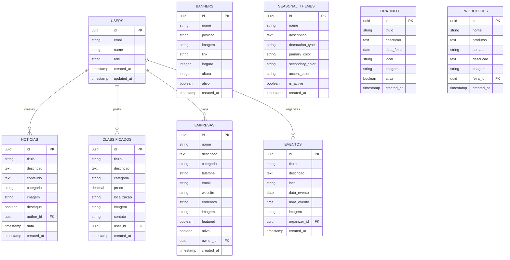

# Technical Architecture Document
## Portal Maria Helena - System Architecture

---

## 1. Architecture Design


## 2. Technology Description

**Frontend:**
- Next.js@13+ with App Router and TypeScript
- React@18 with hooks and context
- Tailwind CSS@3 for styling
- React Hook Form for form management
- Lucide React for icons

**Backend:**
- Supabase (Backend-as-a-Service)
- PostgreSQL database with Row Level Security
- Supabase Auth for authentication
- Supabase Storage for file management

**Development & Deployment:**
- Vercel for hosting and CI/CD
- Git for version control
- ESLint and Prettier for code quality

## 3. Route Definitions

| Route | Purpose |
|-------|---------|
| / | Home page with featured content and navigation |
| /guia | Commercial guide with business directory |
| /guia/[id] | Individual business profile pages |
| /noticias | News portal with article listings |
| /noticias/[id] | Individual news article pages |
| /classificados | Classified ads with search and filters |
| /eventos | Events calendar and listings |
| /eventos/feira-do-produtor | Producer fair dedicated page |
| /servicos | Municipal services and utilities |
| /servicos/clima | Weather information service |
| /servicos/telefones-uteis | Useful phone numbers |
| /servicos/transporte | Public transportation info |
| /contato | Contact form and information |
| /sobre | About page with portal information |
| /anuncie | Advertising information and contact |
| /login | User authentication page |
| /cadastro | User registration page |
| /area-usuario | User dashboard and profile |
| /admin/login | Administrator authentication |
| /admin | Admin dashboard with statistics |
| /admin/noticias | News management interface |
| /admin/classificados | Classified ads management |
| /admin/eventos | Events management |
| /admin/empresas | Business directory management |
| /admin/banners | Banner advertising management |
| /admin/temas-sazonais | Seasonal themes configuration |
| /admin/feira-produtor | Producer fair management |
| /termos | Terms of service |
| /privacidade | Privacy policy |
| /mapa-site | Site map navigation |

## 4. API Definitions

### 4.1 Core API

**Authentication Endpoints**
```
POST /auth/login
```

Request:
| Param Name | Param Type | isRequired | Description |
|------------|------------|------------|-------------|
| email | string | true | User email address |
| password | string | true | User password |

Response:
| Param Name | Param Type | Description |
|------------|------------|-------------|
| user | object | User information and session |
| session | object | Authentication session data |

Example:
```json
{
  "email": "user@example.com",
  "password": "securepassword"
}
```

**Content Management**
```
GET /api/noticias
POST /api/noticias
PUT /api/noticias/[id]
DELETE /api/noticias/[id]
```

**File Upload**
```
POST /api/upload
```

Request:
| Param Name | Param Type | isRequired | Description |
|------------|------------|------------|-------------|
| file | File | true | Image or document file |
| bucket | string | true | Storage bucket name |

Response:
| Param Name | Param Type | Description |
|------------|------------|-------------|
| url | string | Public URL of uploaded file |
| path | string | Storage path reference |

## 5. Server Architecture Diagram


## 6. Data Model

### 6.1 Data Model Definition



### 6.2 Data Definition Language

**Users Table (Supabase Auth)**
```sql
-- Users are managed by Supabase Auth
-- Additional profile information stored in profiles table

CREATE TABLE profiles (
    id UUID REFERENCES auth.users(id) PRIMARY KEY,
    email VARCHAR(255) UNIQUE NOT NULL,
    name VARCHAR(100),
    role VARCHAR(20) DEFAULT 'user' CHECK (role IN ('user', 'business', 'admin')),
    created_at TIMESTAMP WITH TIME ZONE DEFAULT NOW(),
    updated_at TIMESTAMP WITH TIME ZONE DEFAULT NOW()
);

-- RLS Policies
ALTER TABLE profiles ENABLE ROW LEVEL SECURITY;
GRANT SELECT ON profiles TO anon;
GRANT ALL PRIVILEGES ON profiles TO authenticated;
```

**News Table (noticias)**
```sql
CREATE TABLE noticias (
    id UUID PRIMARY KEY DEFAULT gen_random_uuid(),
    titulo VARCHAR(255) NOT NULL,
    descricao TEXT,
    conteudo TEXT NOT NULL,
    categoria VARCHAR(50) NOT NULL,
    imagem TEXT,
    destaque BOOLEAN DEFAULT false,
    author_id UUID REFERENCES auth.users(id),
    data TIMESTAMP WITH TIME ZONE DEFAULT NOW(),
    created_at TIMESTAMP WITH TIME ZONE DEFAULT NOW(),
    updated_at TIMESTAMP WITH TIME ZONE DEFAULT NOW()
);

-- Indexes
CREATE INDEX idx_noticias_categoria ON noticias(categoria);
CREATE INDEX idx_noticias_data ON noticias(data DESC);
CREATE INDEX idx_noticias_destaque ON noticias(destaque);

-- RLS Policies
ALTER TABLE noticias ENABLE ROW LEVEL SECURITY;
GRANT SELECT ON noticias TO anon;
GRANT ALL PRIVILEGES ON noticias TO authenticated;
```

**Business Directory Table (empresas)**
```sql
CREATE TABLE empresas (
    id UUID PRIMARY KEY DEFAULT gen_random_uuid(),
    nome VARCHAR(255) NOT NULL,
    descricao TEXT,
    categoria VARCHAR(100) NOT NULL,
    telefone VARCHAR(20),
    email VARCHAR(255),
    website TEXT,
    endereco TEXT,
    imagem TEXT,
    featured BOOLEAN DEFAULT false,
    ativo BOOLEAN DEFAULT true,
    owner_id UUID REFERENCES auth.users(id),
    created_at TIMESTAMP WITH TIME ZONE DEFAULT NOW(),
    updated_at TIMESTAMP WITH TIME ZONE DEFAULT NOW()
);

-- Indexes
CREATE INDEX idx_empresas_categoria ON empresas(categoria);
CREATE INDEX idx_empresas_featured ON empresas(featured);
CREATE INDEX idx_empresas_ativo ON empresas(ativo);

-- RLS Policies
ALTER TABLE empresas ENABLE ROW LEVEL SECURITY;
GRANT SELECT ON empresas TO anon;
GRANT ALL PRIVILEGES ON empresas TO authenticated;
```

**Classified Ads Table (classificados)**
```sql
CREATE TABLE classificados (
    id UUID PRIMARY KEY DEFAULT gen_random_uuid(),
    titulo VARCHAR(255) NOT NULL,
    descricao TEXT NOT NULL,
    categoria VARCHAR(100) NOT NULL,
    preco DECIMAL(10,2) NOT NULL,
    localizacao VARCHAR(255),
    imagem TEXT,
    contato VARCHAR(255) NOT NULL,
    user_id UUID REFERENCES auth.users(id),
    created_at TIMESTAMP WITH TIME ZONE DEFAULT NOW(),
    updated_at TIMESTAMP WITH TIME ZONE DEFAULT NOW()
);

-- Indexes
CREATE INDEX idx_classificados_categoria ON classificados(categoria);
CREATE INDEX idx_classificados_preco ON classificados(preco);
CREATE INDEX idx_classificados_created_at ON classificados(created_at DESC);

-- RLS Policies
ALTER TABLE classificados ENABLE ROW LEVEL SECURITY;
GRANT SELECT ON classificados TO anon;
GRANT ALL PRIVILEGES ON classificados TO authenticated;
```

**Events Table (eventos)**
```sql
CREATE TABLE eventos (
    id UUID PRIMARY KEY DEFAULT gen_random_uuid(),
    titulo VARCHAR(255) NOT NULL,
    descricao TEXT NOT NULL,
    local VARCHAR(255) NOT NULL,
    data_evento DATE NOT NULL,
    hora_evento TIME,
    imagem TEXT,
    organizer_id UUID REFERENCES auth.users(id),
    created_at TIMESTAMP WITH TIME ZONE DEFAULT NOW(),
    updated_at TIMESTAMP WITH TIME ZONE DEFAULT NOW()
);

-- Indexes
CREATE INDEX idx_eventos_data ON eventos(data_evento);
CREATE INDEX idx_eventos_created_at ON eventos(created_at DESC);

-- RLS Policies
ALTER TABLE eventos ENABLE ROW LEVEL SECURITY;
GRANT SELECT ON eventos TO anon;
GRANT ALL PRIVILEGES ON eventos TO authenticated;
```

**Banner Management Table (banners)**
```sql
CREATE TABLE banners (
    id UUID PRIMARY KEY DEFAULT gen_random_uuid(),
    nome VARCHAR(255) NOT NULL,
    posicao VARCHAR(100) NOT NULL,
    imagem TEXT NOT NULL,
    link TEXT,
    largura INTEGER DEFAULT 400,
    altura INTEGER DEFAULT 200,
    ativo BOOLEAN DEFAULT true,
    created_at TIMESTAMP WITH TIME ZONE DEFAULT NOW(),
    updated_at TIMESTAMP WITH TIME ZONE DEFAULT NOW()
);

-- Indexes
CREATE INDEX idx_banners_posicao ON banners(posicao);
CREATE INDEX idx_banners_ativo ON banners(ativo);

-- RLS Policies
ALTER TABLE banners ENABLE ROW LEVEL SECURITY;
GRANT SELECT ON banners TO anon;
GRANT ALL PRIVILEGES ON banners TO authenticated;
```

**Seasonal Themes Table (seasonal_themes)**
```sql
CREATE TABLE seasonal_themes (
    id UUID PRIMARY KEY DEFAULT gen_random_uuid(),
    name VARCHAR(255) NOT NULL,
    description TEXT,
    decoration_type VARCHAR(50) NOT NULL,
    primary_color VARCHAR(7) NOT NULL,
    secondary_color VARCHAR(7) NOT NULL,
    accent_color VARCHAR(7) NOT NULL,
    background_color VARCHAR(7) DEFAULT '#ffffff',
    is_active BOOLEAN DEFAULT false,
    created_at TIMESTAMP WITH TIME ZONE DEFAULT NOW(),
    updated_at TIMESTAMP WITH TIME ZONE DEFAULT NOW()
);

-- RLS Policies
ALTER TABLE seasonal_themes ENABLE ROW LEVEL SECURITY;
GRANT SELECT ON seasonal_themes TO anon;
GRANT ALL PRIVILEGES ON seasonal_themes TO authenticated;
```

**Producer Fair Tables**
```sql
CREATE TABLE feira_info (
    id UUID PRIMARY KEY DEFAULT gen_random_uuid(),
    titulo VARCHAR(255) NOT NULL,
    descricao TEXT,
    data_feira DATE,
    local VARCHAR(255),
    imagem TEXT,
    ativa BOOLEAN DEFAULT true,
    created_at TIMESTAMP WITH TIME ZONE DEFAULT NOW()
);

CREATE TABLE produtores (
    id UUID PRIMARY KEY DEFAULT gen_random_uuid(),
    nome VARCHAR(255) NOT NULL,
    produtos TEXT NOT NULL,
    contato VARCHAR(255) NOT NULL,
    descricao TEXT,
    imagem TEXT,
    feira_id UUID REFERENCES feira_info(id),
    created_at TIMESTAMP WITH TIME ZONE DEFAULT NOW()
);

-- RLS Policies
ALTER TABLE feira_info ENABLE ROW LEVEL SECURITY;
ALTER TABLE produtores ENABLE ROW LEVEL SECURITY;
GRANT SELECT ON feira_info TO anon;
GRANT SELECT ON produtores TO anon;
GRANT ALL PRIVILEGES ON feira_info TO authenticated;
GRANT ALL PRIVILEGES ON produtores TO authenticated;
```

**Storage Buckets Configuration**
```sql
-- Create storage buckets for file uploads
INSERT INTO storage.buckets (id, name, public) VALUES 
('banners', 'banners', true),
('empresas', 'empresas', true),
('noticias', 'noticias', true),
('classificados', 'classificados', true),
('eventos', 'eventos', true);

-- Storage policies for public access
CREATE POLICY "Public Access" ON storage.objects FOR SELECT USING (true);
CREATE POLICY "Authenticated Upload" ON storage.objects FOR INSERT WITH CHECK (auth.role() = 'authenticated');
```

---

**Document Version:** 1.0  
**Last Updated:** January 2025  
**Architecture Review:** March 2025  
**Technical Lead:** Development Team