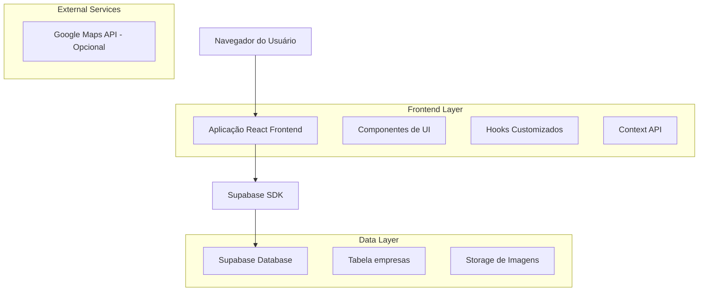
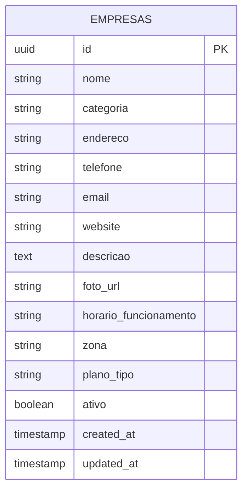

# Diretório de Empresas Locais - Documento de Arquitetura Técnica

## 1. Arquitetura do Sistema



## 2. Descrição das Tecnologias

- **Frontend:** React@18 + TypeScript + TailwindCSS@3 + Next.js@13
- **Backend:** Supabase (PostgreSQL + Auth + Storage)
- **UI Components:** Headless UI + Lucide React Icons
- **Maps:** Google Maps API ou Leaflet (opcional)

## 3. Definições de Rotas

| Rota | Propósito |
|------|-----------|
| /empresas-locais | Página principal do diretório com busca e filtros |
| /empresas-locais/categoria/[categoria] | Listagem filtrada por categoria específica |
| /empresas-locais/mapa | Visualização em mapa das empresas (opcional) |

## 4. Definições de API

### 4.1 APIs Principais

**Busca de empresas básicas**
```
GET /api/empresas/basicas
```

Parâmetros de Query:
| Nome do Parâmetro | Tipo | Obrigatório | Descrição |
|-------------------|------|-------------|-----------|
| search | string | false | Termo de busca (nome ou descrição) |
| categoria | string | false | Filtro por categoria |
| zona | string | false | Filtro por zona/bairro |
| aberto | boolean | false | Apenas empresas abertas no momento |
| page | number | false | Número da página (padrão: 1) |
| limit | number | false | Itens por página (padrão: 12) |

Resposta:
| Nome do Parâmetro | Tipo | Descrição |
|-------------------|------|-----------|
| empresas | array | Lista de empresas encontradas |
| total | number | Total de empresas encontradas |
| hasMore | boolean | Se há mais páginas disponíveis |

Exemplo de Resposta:
```json
{
  "empresas": [
    {
      "id": "uuid",
      "nome": "Padaria do João",
      "categoria": "Alimentação",
      "endereco": "Rua das Flores, 123",
      "telefone": "(44) 3333-4444",
      "horario_funcionamento": "06:00-18:00",
      "foto_url": "https://...",
      "descricao": "Pães frescos todos os dias",
      "zona": "Centro",
      "status_aberto": true
    }
  ],
  "total": 45,
  "hasMore": true
}
```

## 5. Modelo de Dados

### 5.1 Definição do Modelo de Dados



### 5.2 Linguagem de Definição de Dados

**Consulta otimizada para empresas básicas**
```sql
-- Função para buscar empresas básicas com filtros
CREATE OR REPLACE FUNCTION buscar_empresas_basicas(
  p_search TEXT DEFAULT NULL,
  p_categoria TEXT DEFAULT NULL,
  p_zona TEXT DEFAULT NULL,
  p_limit INTEGER DEFAULT 12,
  p_offset INTEGER DEFAULT 0
)
RETURNS TABLE (
  id UUID,
  nome TEXT,
  categoria TEXT,
  endereco TEXT,
  telefone TEXT,
  foto_url TEXT,
  descricao TEXT,
  zona TEXT,
  horario_funcionamento TEXT,
  status_aberto BOOLEAN
) AS $$
BEGIN
  RETURN QUERY
  SELECT 
    e.id,
    e.nome,
    e.categoria,
    e.endereco,
    e.telefone,
    e.foto_url,
    e.descricao,
    e.zona,
    e.horario_funcionamento,
    -- Lógica para determinar se está aberto (simplificada)
    CASE 
      WHEN e.horario_funcionamento IS NOT NULL THEN true
      ELSE false
    END as status_aberto
  FROM empresas e
  WHERE 
    e.ativo = true 
    AND e.plano_tipo = 'basic'
    AND (p_search IS NULL OR e.nome ILIKE '%' || p_search || '%' OR e.descricao ILIKE '%' || p_search || '%')
    AND (p_categoria IS NULL OR e.categoria = p_categoria)
    AND (p_zona IS NULL OR e.zona = p_zona)
  ORDER BY e.nome ASC
  LIMIT p_limit
  OFFSET p_offset;
END;
$$ LANGUAGE plpgsql;

-- Índices para performance
CREATE INDEX IF NOT EXISTS idx_empresas_basicas_busca 
ON empresas(plano_tipo, ativo, categoria, zona) 
WHERE plano_tipo = 'basic' AND ativo = true;

CREATE INDEX IF NOT EXISTS idx_empresas_nome_fulltext 
ON empresas USING gin(to_tsvector('portuguese', nome || ' ' || COALESCE(descricao, '')));

-- Permissões RLS
GRANT SELECT ON empresas TO anon;
GRANT SELECT ON empresas TO authenticated;
```

**Dados iniciais para teste**
```sql
-- Inserir algumas empresas básicas para demonstração
INSERT INTO empresas (nome, categoria, endereco, telefone, descricao, zona, plano_tipo, ativo, foto_url) VALUES
('Padaria Pão Dourado', 'Alimentação', 'Rua das Flores, 123', '(44) 3333-1111', 'Pães frescos e salgados todos os dias', 'Centro', 'basic', true, 'https://images.unsplash.com/photo-1509440159596-0249088772ff?w=400'),
('Farmácia Saúde Total', 'Saúde', 'Av. Brasil, 456', '(44) 3333-2222', 'Medicamentos e produtos de saúde', 'Zona Sul', 'basic', true, 'https://images.unsplash.com/photo-1576091160399-112ba8d25d1f?w=400'),
('Auto Peças Central', 'Automotivo', 'Rua Industrial, 789', '(44) 3333-3333', 'Peças automotivas em geral', 'Zona Norte', 'basic', true, 'https://images.unsplash.com/photo-1486262715619-67b85e0b08d3?w=400'),
('Salão Beleza & Estilo', 'Beleza', 'Rua da Moda, 321', '(44) 3333-4444', 'Cortes, penteados e tratamentos', 'Centro', 'basic', true, 'https://images.unsplash.com/photo-1560066984-138dadb4c035?w=400');