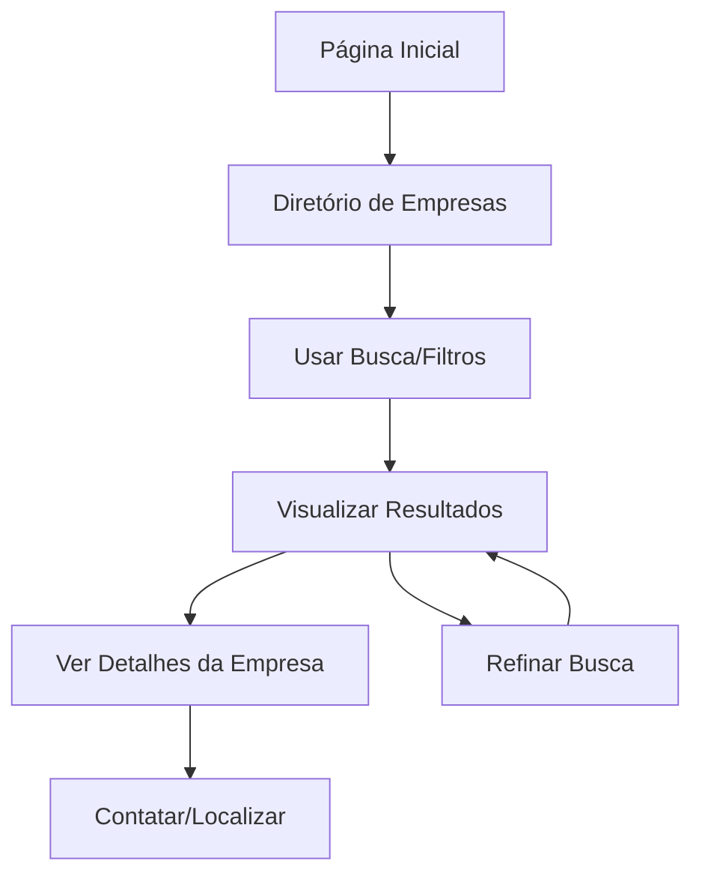

# Diretório de Empresas Locais - Documento de Requisitos do Produto

## 1. Visão Geral do Produto

Uma página moderna e elegante para exibir todas as empresas locais com plano básico, permitindo que os cidadãos descubram facilmente estabelecimentos comerciais da cidade através de uma interface intuitiva e visualmente atrativa.

- **Objetivo Principal:** Democratizar o acesso às empresas locais, criando uma vitrine digital elegante para estabelecimentos do plano básico
- **Público-Alvo:** Moradores locais, turistas e visitantes procurando serviços e comércios na cidade
- **Valor de Mercado:** Fortalecer o comércio local e aumentar a visibilidade de pequenas empresas

## 2. Funcionalidades Principais

### 2.1 Papéis de Usuário
| Papel | Método de Acesso | Permissões Principais |
|-------|------------------|----------------------|
| Visitante | Acesso livre | Visualizar empresas, pesquisar, filtrar |
| Usuário Logado | Login opcional | Favoritar empresas, avaliar (futuro) |

### 2.2 Módulos de Funcionalidade

Nossa página de diretório de empresas locais consiste nas seguintes seções principais:
1. **Página de Diretório**: sistema de busca avançada, filtros inteligentes, grid de empresas elegante
2. **Cards de Empresa**: informações essenciais, fotos, contato direto
3. **Sistema de Filtros**: por categoria, localização, horário de funcionamento
4. **Mapa Interativo**: visualização geográfica das empresas

### 2.3 Detalhes das Páginas

| Nome da Página | Módulo | Descrição da Funcionalidade |
|----------------|--------|----------------------------|
| Diretório Principal | Sistema de Busca | Barra de pesquisa inteligente com autocomplete, busca por nome, categoria ou localização |
| Diretório Principal | Filtros Avançados | Filtros por categoria, bairro/zona, horário de funcionamento, serviços oferecidos |
| Diretório Principal | Grid de Empresas | Layout em cards responsivo com informações essenciais, fotos e ações rápidas |
| Diretório Principal | Mapa Interativo | Visualização geográfica opcional das empresas com marcadores personalizados |
| Diretório Principal | Paginação Inteligente | Sistema de scroll infinito ou paginação tradicional para performance |
| Cards de Empresa | Informações Básicas | Nome, categoria, endereço, telefone, horário, foto/logo, descrição breve |
| Cards de Empresa | Ações Rápidas | Botões para ligar, ver no mapa, compartilhar, favoritar |

## 3. Fluxo Principal de Uso

**Fluxo do Visitante:**
O usuário acessa a página do diretório, utiliza a barra de busca ou filtros para encontrar empresas específicas, visualiza os cards elegantes com informações essenciais, e pode entrar em contato diretamente ou ver a localização no mapa.

## 4. Design da Interface do Usuário

### 4.1 Estilo de Design

**Elementos principais do design:**
- **Cores Primárias:** Azul moderno (#2563eb), Verde suave (#10b981)
- **Cores Secundárias:** Cinza elegante (#64748b), Branco puro (#ffffff)
- **Estilo dos Botões:** Arredondados com sombras suaves e efeitos hover
- **Tipografia:** Inter ou Poppins, tamanhos 14px-24px para hierarquia clara
- **Layout:** Grid responsivo com cards elevados e espaçamento generoso
- **Ícones:** Lucide React ou Heroicons para consistência moderna

### 4.2 Visão Geral do Design das Páginas

| Nome da Página | Módulo | Elementos de UI |
|----------------|--------|-----------------|
| Diretório Principal | Header de Busca | Barra de pesquisa centralizada com ícone de lupa, placeholder inteligente, botão de filtros |
| Diretório Principal | Seção de Filtros | Chips selecionáveis para categorias, dropdown para localização, toggle para "Aberto agora" |
| Diretório Principal | Grid de Empresas | Cards com sombra suave, imagem de destaque, badge de categoria, informações organizadas |
| Diretório Principal | Mapa Interativo | Mapa moderno com marcadores customizados, popup com informações básicas |
| Cards de Empresa | Layout do Card | Imagem 16:9, título em destaque, categoria com cor, endereço com ícone, botões de ação |
| Cards de Empresa | Informações de Contato | Telefone clicável, horário com status "Aberto/Fechado", ícones intuitivos |

### 4.3 Responsividade

**Design Mobile-First:** Otimizado para dispositivos móveis com navegação por toque, cards empilhados verticalmente, filtros em modal deslizante, e botões de ação facilmente acessíveis.

**Breakpoints:**
- Mobile: 1 coluna, filtros em modal
- Tablet: 2 colunas, filtros laterais
- Desktop: 3-4 colunas, filtros fixos na lateral