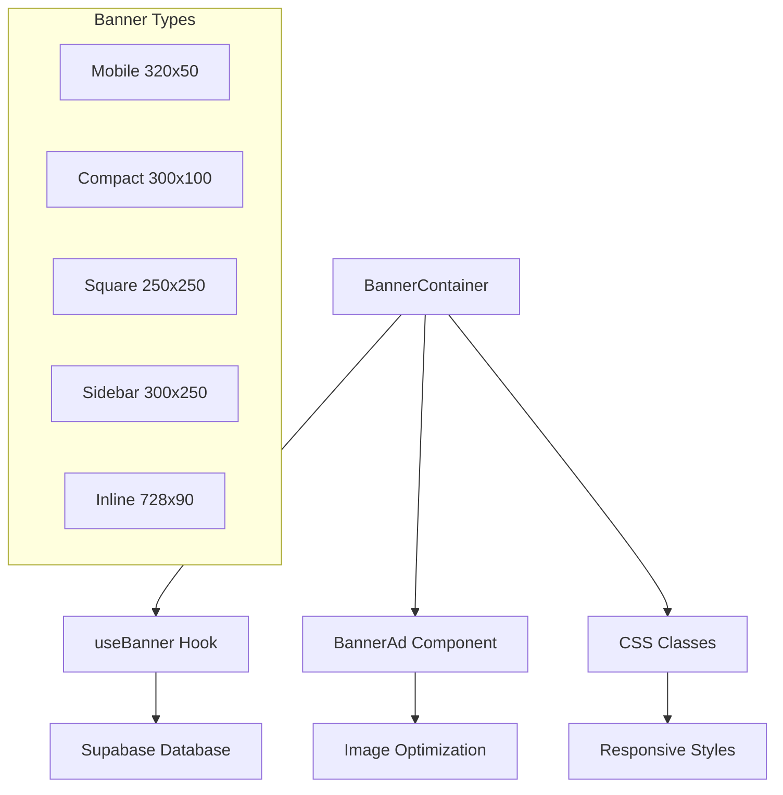
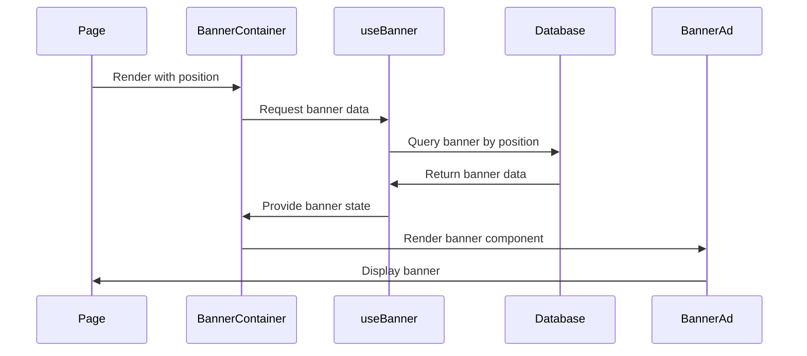

# Implementação de Banners Melhorados - Guia Técnico

## 1. Arquitetura da Solução

### 1.1 Componentes Principais



### 1.2 Fluxo de Dados



## 2. Estrutura de Dados

### 2.1 Schema do Banner Atualizado

```sql
-- Adicionar novos campos à tabela banners
ALTER TABLE banners ADD COLUMN IF NOT EXISTS banner_type VARCHAR(20) DEFAULT 'custom';
ALTER TABLE banners ADD COLUMN IF NOT EXISTS alignment VARCHAR(10) DEFAULT 'center';
ALTER TABLE banners ADD COLUMN IF NOT EXISTS spacing VARCHAR(10) DEFAULT 'medium';
ALTER TABLE banners ADD COLUMN IF NOT EXISTS priority INTEGER DEFAULT 1;

-- Índices para performance
CREATE INDEX IF NOT EXISTS idx_banners_type ON banners(banner_type);
CREATE INDEX IF NOT EXISTS idx_banners_priority ON banners(priority);
```

### 2.2 Interface TypeScript Atualizada

```typescript
interface Banner {
  id: string
  nome: string
  posicao: string
  imagem: string
  link?: string
  largura: number
  altura: number
  ativo: boolean
  banner_type: 'mobile' | 'compact' | 'square' | 'sidebar' | 'inline' | 'custom'
  alignment: 'center' | 'left' | 'right'
  spacing: 'none' | 'small' | 'medium' | 'large'
  priority: number
  data_inicio?: string
  data_fim?: string
  created_at: string
  updated_at: string
}
```

## 3. Implementação dos Componentes

### 3.1 BannerContainer Melhorado

```typescript
// components/BannerContainer.tsx
import React, { useRef, useEffect } from 'react'
import { useBanner } from '../hooks/useBanners'
import { useAnalytics } from '../hooks/useAnalytics'
import BannerAd from './BannerAd'

interface BannerContainerProps {
  position: string
  className?: string
  width?: number
  height?: number
  showPlaceholder?: boolean
  bannerType?: 'sidebar' | 'inline' | 'small' | 'mobile' | 'compact' | 'square' | 'custom'
  alignment?: 'center' | 'left' | 'right'
  spacing?: 'none' | 'small' | 'medium' | 'large'
  priority?: number
}

const BannerContainer: React.FC<BannerContainerProps> = ({
  position,
  className = '',
  width,
  height,
  showPlaceholder = true,
  bannerType = 'custom',
  alignment = 'center',
  spacing = 'medium',
  priority = 1
}) => {
  const { banner, loading, error } = useBanner(position)
  const { trackImpression } = useAnalytics()
  const bannerRef = useRef<HTMLDivElement>(null)

  // Rastreamento de impressão
  useEffect(() => {
    if (banner && bannerRef.current) {
      const observer = new IntersectionObserver(
        (entries) => {
          entries.forEach((entry) => {
            if (entry.isIntersecting) {
              trackImpression(banner.id, position)
              observer.unobserve(entry.target)
            }
          })
        },
        { threshold: 0.5 }
      )

      observer.observe(bannerRef.current)
      return () => observer.disconnect()
    }
  }, [banner, position, trackImpression])

  // Gerar classes CSS baseadas nas props
  const getContainerClasses = () => {
    const baseClasses = ['banner-container-safe', 'banner-responsive']
    
    // Tipo de banner
    switch (bannerType) {
      case 'mobile':
        baseClasses.push('banner-mobile')
        break
      case 'compact':
        baseClasses.push('banner-compact')
        break
      case 'square':
        baseClasses.push('banner-square-small')
        break
      case 'sidebar':
        baseClasses.push('banner-sidebar')
        break
      case 'inline':
        baseClasses.push('banner-inline')
        break
      case 'small':
        baseClasses.push('banner-small')
        break
    }
    
    // Alinhamento
    switch (alignment) {
      case 'left':
        baseClasses.push('banner-left-align')
        break
      case 'right':
        baseClasses.push('banner-right-align')
        break
      default:
        baseClasses.push('banner-center-align')
    }
    
    // Espaçamento
    switch (spacing) {
      case 'none':
        break
      case 'small':
        baseClasses.push('banner-spacing-small')
        break
      case 'large':
        baseClasses.push('banner-spacing-large')
        break
      default:
        baseClasses.push('banner-spacing-medium')
    }
    
    // Proteção contra overflow
    baseClasses.push('banner-overflow-protection')
    
    return baseClasses.join(' ')
  }

  // Loading state
  if (loading) {
    return (
      <div className={`${getContainerClasses()} ${className}`}>
        <div className="banner-skeleton animate-pulse bg-gray-200 rounded-lg"></div>
      </div>
    )
  }

  // Error state
  if (error) {
    console.error('Erro no banner:', error)
    return null
  }

  // No banner found
  if (!banner) {
    if (!showPlaceholder) return null
    
    return (
      <div className={`${getContainerClasses()} ${className}`} ref={bannerRef}>
        <div className="ad-space">
          <div className="text-center text-gray-400">
            <i className="fas fa-ad text-2xl mb-2"></i>
            <p className="text-xs">Espaço Publicitário</p>
            <p className="text-xs opacity-75">{position}</p>
          </div>
        </div>
      </div>
    )
  }

  // Render banner
  return (
    <div className={`${getContainerClasses()} ${className}`} ref={bannerRef}>
      <BannerAd
        position={position}
        width={banner.largura}
        height={banner.altura}
        imageUrl={banner.imagem}
        linkUrl={banner.link}
        altText={banner.nome}
        title={banner.nome}
        bannerId={banner.id}
        className="w-full h-full"
      />
    </div>
  )
}

export default BannerContainer
```

### 3.2 Hook useBanner Otimizado

```typescript
// hooks/useBanners.ts
import { useState, useEffect, useCallback } from 'react'
import { supabase, Banner } from '../lib/supabase'

interface UseBannerReturn {
  banner: Banner | null
  loading: boolean
  error: string | null
  refetch: () => void
}

export const useBanner = (position: string): UseBannerReturn => {
  const [banner, setBanner] = useState<Banner | null>(null)
  const [loading, setLoading] = useState(true)
  const [error, setError] = useState<string | null>(null)

  const fetchBanner = useCallback(async () => {
    try {
      setLoading(true)
      setError(null)

      const now = new Date().toISOString()

      const { data, error: fetchError } = await supabase
        .from('banners')
        .select('*')
        .eq('posicao', position)
        .eq('ativo', true)
        .or(`data_inicio.is.null,data_inicio.lte.${now}`)
        .or(`data_fim.is.null,data_fim.gte.${now}`)
        .order('priority', { ascending: false })
        .limit(1)
        .maybeSingle()

      if (fetchError) {
        throw fetchError
      }

      setBanner(data)
    } catch (err) {
      console.error('Erro ao buscar banner:', err)
      setError(err instanceof Error ? err.message : 'Erro desconhecido')
    } finally {
      setLoading(false)
    }
  }, [position])

  useEffect(() => {
    fetchBanner()
  }, [fetchBanner])

  return { banner, loading, error, refetch: fetchBanner }
}

// Hook para múltiplos banners
export const useBanners = (positions: string[]) => {
  const [banners, setBanners] = useState<Record<string, Banner | null>>({})
  const [loading, setLoading] = useState(true)
  const [error, setError] = useState<string | null>(null)

  useEffect(() => {
    const fetchBanners = async () => {
      try {
        setLoading(true)
        setError(null)

        const now = new Date().toISOString()

        const { data, error: fetchError } = await supabase
          .from('banners')
          .select('*')
          .in('posicao', positions)
          .eq('ativo', true)
          .or(`data_inicio.is.null,data_inicio.lte.${now}`)
          .or(`data_fim.is.null,data_fim.gte.${now}`)
          .order('priority', { ascending: false })

        if (fetchError) {
          throw fetchError
        }

        // Organizar banners por posição
        const bannersByPosition: Record<string, Banner | null> = {}
        positions.forEach(position => {
          bannersByPosition[position] = data?.find(b => b.posicao === position) || null
        })

        setBanners(bannersByPosition)
      } catch (err) {
        console.error('Erro ao buscar banners:', err)
        setError(err instanceof Error ? err.message : 'Erro desconhecido')
      } finally {
        setLoading(false)
      }
    }

    if (positions.length > 0) {
      fetchBanners()
    }
  }, [positions])

  return { banners, loading, error }
}
```

## 4. CSS Responsivo Completo

### 4.1 Estilos Base

```css
/* globals.css - Adicionar ao final */

/* === SISTEMA DE BANNERS MELHORADO === */

/* Containers base */
.banner-container-safe {
  overflow: hidden;
  max-width: 100%;
  box-sizing: border-box;
  position: relative;
}

.banner-responsive {
  width: 100%;
  max-width: 100%;
  overflow: hidden;
  position: relative;
}

/* Proteção contra overflow */
.banner-overflow-protection {
  max-width: calc(100vw - 2rem);
  margin: 0 auto;
}

@media (max-width: 640px) {
  .banner-overflow-protection {
    max-width: calc(100vw - 1rem);
  }
}

/* === TIPOS DE BANNER === */

/* Mobile Banner (320x50) */
.banner-mobile {
  width: 320px;
  height: 50px;
  aspect-ratio: 320/50;
  margin: 1rem auto;
  max-width: 100%;
}

@media (max-width: 640px) {
  .banner-mobile {
    width: 100%;
    max-width: 320px;
    height: auto;
    min-height: 50px;
  }
}

/* Compact Banner (300x100) */
.banner-compact {
  width: 300px;
  height: 100px;
  aspect-ratio: 3/1;
  margin: 1rem auto;
  max-width: 100%;
}

@media (max-width: 640px) {
  .banner-compact {
    width: 100%;
    max-width: 300px;
    height: auto;
    min-height: 100px;
  }
}

/* Square Small Banner (250x250) */
.banner-square-small {
  width: 250px;
  height: 250px;
  aspect-ratio: 1/1;
  margin: 1rem auto;
  max-width: 100%;
}

@media (max-width: 768px) {
  .banner-square-small {
    width: 200px;
    height: 200px;
  }
}

@media (max-width: 480px) {
  .banner-square-small {
    width: 150px;
    height: 150px;
  }
}

/* === SISTEMA DE ALINHAMENTO === */

.banner-center-align {
  display: flex;
  justify-content: center;
  align-items: center;
  width: 100%;
}

.banner-left-align {
  display: flex;
  justify-content: flex-start;
  align-items: center;
  width: 100%;
}

.banner-right-align {
  display: flex;
  justify-content: flex-end;
  align-items: center;
  width: 100%;
}

/* === SISTEMA DE ESPAÇAMENTO === */

.banner-spacing-none {
  margin: 0;
}

.banner-spacing-small {
  margin: 0.5rem 0;
}

.banner-spacing-medium {
  margin: 1rem 0;
}

.banner-spacing-large {
  margin: 2rem 0;
}

@media (max-width: 768px) {
  .banner-spacing-large {
    margin: 1rem 0;
  }
  
  .banner-spacing-medium {
    margin: 0.75rem 0;
  }
}

/* === GRID PARA MÚLTIPLOS BANNERS === */

.banner-multi-container {
  display: grid;
  grid-template-columns: repeat(auto-fit, minmax(250px, 1fr));
  gap: 1rem;
  padding: 1rem;
  max-width: 1200px;
  margin: 0 auto;
  align-items: start;
  justify-items: center;
}

@media (max-width: 768px) {
  .banner-multi-container {
    grid-template-columns: 1fr;
    gap: 0.5rem;
    padding: 0.5rem;
  }
}

/* Grid específico para footer */
.banner-footer-grid {
  display: grid;
  grid-template-columns: repeat(auto-fit, minmax(280px, 1fr));
  gap: 1rem;
  padding: 1rem;
  max-width: 1200px;
  margin: 0 auto;
}

@media (max-width: 640px) {
  .banner-footer-grid {
    grid-template-columns: 1fr;
    gap: 0.5rem;
  }
}

/* === ANIMAÇÕES E TRANSIÇÕES === */

.banner-transition {
  transition: all 0.3s cubic-bezier(0.4, 0, 0.2, 1);
}

.banner-hover:hover {
  transform: scale(1.02);
  box-shadow: 0 10px 25px -3px rgba(0, 0, 0, 0.1), 0 4px 6px -2px rgba(0, 0, 0, 0.05);
}

/* === SKELETON LOADING === */

.banner-skeleton {
  background: linear-gradient(90deg, #f0f0f0 25%, #e0e0e0 50%, #f0f0f0 75%);
  background-size: 200% 100%;
  animation: loading 1.5s infinite;
  border-radius: 0.5rem;
}

@keyframes loading {
  0% {
    background-position: 200% 0;
  }
  100% {
    background-position: -200% 0;
  }
}

/* === ACESSIBILIDADE === */

@media (prefers-reduced-motion: reduce) {
  .banner-transition,
  .banner-hover:hover,
  .banner-skeleton {
    transition: none;
    transform: none;
    animation: none;
  }
}

/* === MODO ESCURO === */

@media (prefers-color-scheme: dark) {
  .banner-skeleton {
    background: linear-gradient(90deg, #1e293b 25%, #334155 50%, #1e293b 75%);
    background-size: 200% 100%;
  }
}

/* === INTEGRAÇÃO COM CONTEÚDO === */

.banner-content-separator {
  position: relative;
  margin: 2rem 0;
}

.banner-content-separator::before {
  content: '';
  position: absolute;
  top: -1rem;
  left: 50%;
  transform: translateX(-50%);
  width: 60px;
  height: 1px;
  background: linear-gradient(90deg, transparent, #e2e8f0, transparent);
}

@media (max-width: 768px) {
  .banner-content-separator {
    margin: 1rem 0;
  }
}

/* === POSICIONAMENTO ESPECÍFICO === */

/* Banner fixo no topo */
.banner-fixed-top {
  position: fixed;
  top: 0;
  left: 0;
  right: 0;
  z-index: 1000;
  background: white;
  box-shadow: 0 2px 4px rgba(0,0,0,0.1);
}

/* Banner sticky */
.banner-sticky {
  position: sticky;
  top: 0;
  z-index: 100;
}

/* Banner inline no conteúdo */
.banner-inline-content {
  margin: 2rem auto;
  max-width: 100%;
  text-align: center;
}

@media (max-width: 768px) {
  .banner-inline-content {
    margin: 1rem auto;
  }
}
```

## 5. Implementação nas Páginas

### 5.1 Página Inicial com Novos Banners

```typescript
// pages/index.tsx - Exemplo de implementação
import BannerContainer from '../components/BannerContainer'

export default function HomePage() {
  return (
    <div>
      {/* Banner fixo no topo (mobile) */}
      <BannerContainer
        position="Mobile - Topo"
        bannerType="mobile"
        alignment="center"
        spacing="none"
        className="md:hidden"
      />

      {/* Header */}
      <header>
        {/* Conteúdo do header */}
        
        {/* Banner abaixo do menu */}
        <BannerContainer
          position="Header - Inferior"
          bannerType="inline"
          alignment="center"
          spacing="small"
        />
      </header>

      {/* Conteúdo principal */}
      <main>
        {/* Hero section */}
        <section>
          {/* Conteúdo hero */}
        </section>

        {/* Banner entre seções */}
        <BannerContainer
          position="Conteúdo - Entre Seções"
          bannerType="compact"
          alignment="center"
          spacing="medium"
          className="banner-content-separator"
        />

        {/* Outras seções */}
      </main>

      {/* Footer com múltiplos banners */}
      <footer>
        <div className="banner-footer-grid">
          <BannerContainer
            position="Footer - Múltiplo 1"
            bannerType="compact"
            alignment="center"
            spacing="small"
          />
          <BannerContainer
            position="Footer - Múltiplo 2"
            bannerType="compact"
            alignment="center"
            spacing="small"
          />
          <BannerContainer
            position="Footer - Múltiplo 3"
            bannerType="compact"
            alignment="center"
            spacing="small"
          />
        </div>
      </footer>
    </div>
  )
}
```

### 5.2 Página de Notícias com Banners Contextuais

```typescript
// pages/noticias/[id].tsx
export default function NoticiaPage() {
  return (
    <div className="container mx-auto px-4">
      <div className="grid grid-cols-1 lg:grid-cols-4 gap-6">
        {/* Conteúdo principal */}
        <article className="lg:col-span-3">
          <h1>Título da Notícia</h1>
          
          {/* Banner após título */}
          <BannerContainer
            position="Notícia - Após Título"
            bannerType="mobile"
            alignment="center"
            spacing="medium"
          />

          <div className="content">
            <p>Primeiro parágrafo...</p>
            <p>Segundo parágrafo...</p>
            
            {/* Banner no meio do conteúdo */}
            <BannerContainer
              position="Conteúdo - Meio"
              bannerType="square"
              alignment="center"
              spacing="large"
              className="banner-content-separator"
            />
            
            <p>Continuação do conteúdo...</p>
          </div>
        </article>

        {/* Sidebar */}
        <aside className="lg:col-span-1">
          {/* Banner sidebar topo */}
          <BannerContainer
            position="Sidebar - Quadrado Pequeno"
            bannerType="square"
            alignment="center"
            spacing="medium"
          />

          {/* Outros conteúdos da sidebar */}
          
          {/* Banner sidebar meio */}
          <BannerContainer
            position="Sidebar Direita"
            bannerType="sidebar"
            alignment="center"
            spacing="medium"
          />
        </aside>
      </div>
    </div>
  )
}
```

## 6. Painel Administrativo Atualizado

### 6.1 Novas Posições para o Array

```typescript
// pages/admin/banners.tsx - Atualizar posicoesBanner
const posicoesBanner = [
  // Posições existentes...
  
  // Novas posições mobile
  {
    nome: 'Mobile - Topo',
    descricao: 'Banner otimizado para mobile no topo da página',
    tamanhoRecomendado: '320x50 (Mobile Banner)',
    larguraRecomendada: 320,
    alturaRecomendada: 50,
    paginas: ['Todas as páginas'],
    tipo: 'mobile'
  },
  
  // Novas posições compact
  {
    nome: 'Conteúdo - Entre Seções',
    descricao: 'Banner compacto entre seções de conteúdo',
    tamanhoRecomendado: '300x100 (Compact)',
    larguraRecomendada: 300,
    alturaRecomendada: 100,
    paginas: ['Notícias', 'Eventos', 'Empresas'],
    tipo: 'compact'
  },
  
  // Novas posições square
  {
    nome: 'Sidebar - Quadrado Pequeno',
    descricao: 'Banner quadrado pequeno para sidebar',
    tamanhoRecomendado: '250x250 (Square)',
    larguraRecomendada: 250,
    alturaRecomendada: 250,
    paginas: ['Notícias', 'Eventos', 'Empresas'],
    tipo: 'square'
  },
  
  // Footer múltiplo
  {
    nome: 'Footer - Múltiplo 1',
    descricao: 'Primeiro banner no footer (grid)',
    tamanhoRecomendado: '300x100 (Compact)',
    larguraRecomendada: 300,
    alturaRecomendada: 100,
    paginas: ['Todas as páginas'],
    tipo: 'compact'
  },
  {
    nome: 'Footer - Múltiplo 2',
    descricao: 'Segundo banner no footer (grid)',
    tamanhoRecomendado: '300x100 (Compact)',
    larguraRecomendada: 300,
    alturaRecomendada: 100,
    paginas: ['Todas as páginas'],
    tipo: 'compact'
  },
  {
    nome: 'Footer - Múltiplo 3',
    descricao: 'Terceiro banner no footer (grid)',
    tamanhoRecomendado: '300x100 (Compact)',
    larguraRecomendada: 300,
    alturaRecomendada: 100,
    paginas: ['Todas as páginas'],
    tipo: 'compact'
  },
  
  // Posições específicas por página
  {
    nome: 'Empresas Locais - Topo',
    descricao: 'Banner no topo da página de empresas locais',
    tamanhoRecomendado: '728x90 (Leaderboard)',
    larguraRecomendada: 728,
    alturaRecomendada: 90,
    paginas: ['Empresas Locais'],
    tipo: 'inline'
  },
  {
    nome: 'Empresas Locais - Entre Cards',
    descricao: 'Banner entre os cards de empresas (a cada 6)',
    tamanhoRecomendado: '300x100 (Compact)',
    larguraRecomendada: 300,
    alturaRecomendada: 100,
    paginas: ['Empresas Locais'],
    tipo: 'compact'
  },
  {
    nome: 'Notícia - Após Título',
    descricao: 'Banner logo após o título da notícia',
    tamanhoRecomendado: '320x50 (Mobile)',
    larguraRecomendada: 320,
    alturaRecomendada: 50,
    paginas: ['Detalhes da Notícia'],
    tipo: 'mobile'
  }
]
```

## 7. Testes e Validação

### 7.1 Checklist de Testes

```typescript
// Testes de responsividade
const testResponsiveness = () => {
  const breakpoints = [320, 640, 768, 1024, 1280]
  
  breakpoints.forEach(width => {
    // Simular viewport
    window.resizeTo(width, 800)
    
    // Verificar se banners não quebram layout
    const banners = document.querySelectorAll('.banner-container-safe')
    banners.forEach(banner => {
      const rect = banner.getBoundingClientRect()
      console.assert(rect.width <= window.innerWidth, `Banner overflow at ${width}px`)
    })
  })
}

// Teste de performance
const testPerformance = () => {
  const observer = new PerformanceObserver((list) => {
    list.getEntries().forEach((entry) => {
      if (entry.name.includes('banner')) {
        console.log(`Banner load time: ${entry.duration}ms`)
      }
    })
  })
  
  observer.observe({ entryTypes: ['measure'] })
}
```

### 7.2 Métricas de Qualidade

- **Tempo de carregamento**: < 200ms por banner
- **Cumulative Layout Shift**: < 0.1
- **Responsividade**: 100% em todos os breakpoints
- **Acessibilidade**: Score > 95
- **Performance**: Score > 90

## 8. Deployment e Monitoramento

### 8.1 Processo de Deploy

1. **Testes locais**
   ```bash
   npm run test:banners
   npm run test:responsive
   ```

2. **Build e verificação**
   ```bash
   npm run build
   npm run analyze
   ```

3. **Deploy staging**
   ```bash
   vercel --env staging
   ```

4. **Testes em produção**
   ```bash
   npm run test:e2e:banners
   ```

### 8.2 Monitoramento

```typescript
// Analytics para banners
const trackBannerMetrics = () => {
  // Impressões
  const impressions = document.querySelectorAll('[data-banner-impression]')
  
  // Cliques
  const clicks = document.querySelectorAll('[data-banner-click]')
  
  // Performance
  const loadTimes = performance.getEntriesByType('measure')
    .filter(entry => entry.name.includes('banner'))
  
  // Enviar métricas
  analytics.track('banner_metrics', {
    impressions: impressions.length,
    clicks: clicks.length,
    avgLoadTime: loadTimes.reduce((acc, entry) => acc + entry.duration, 0) / loadTimes.length
  })
}
```

## 9. Conclusão

Esta implementação oferece:

✅ **Sistema robusto** de banners responsivos
✅ **Performance otimizada** com lazy loading
✅ **Flexibilidade total** de posicionamento
✅ **Monitoramento completo** de métricas
✅ **Manutenibilidade** através de componentes modulares

O sistema está pronto para produção e pode ser expandido conforme necessário.