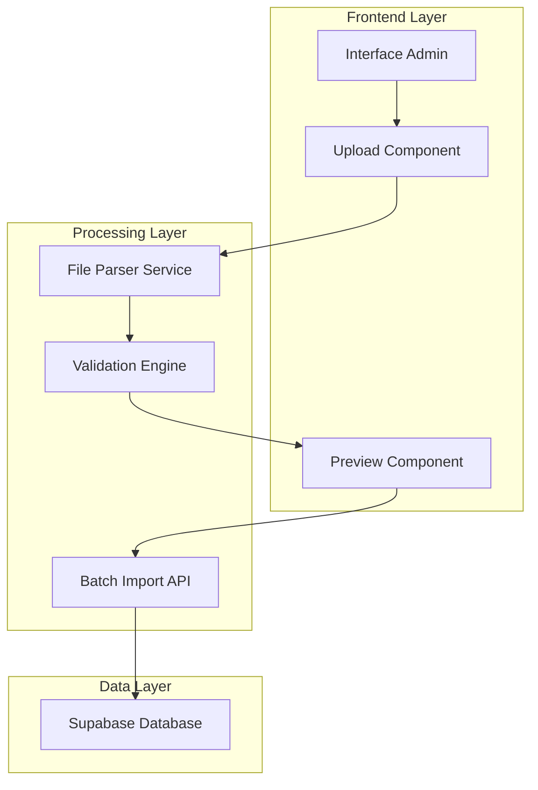

# Sistema de Importação em Lote de Empresas - Arquitetura Técnica

## 1. Arquitetura do Sistema



## 2. Stack Tecnológico

- **Frontend**: React@18 + TypeScript + Tailwind CSS
- **File Processing**: xlsx@0.18.5 + papaparse@5.4.1
- **Upload**: react-dropzone@14.2.3
- **Validation**: zod@3.22.4
- **Backend**: Next.js API Routes
- **Database**: Supabase (PostgreSQL)
- **Storage**: Supabase Storage para templates

## 3. Definição de Rotas

| Rota | Propósito |
|------|-----------|
| /admin/empresas/importar | Página principal de importação em lote |
| /admin/empresas/relatorios | Histórico e relatórios de importações |
| /admin/empresas/gerenciar | Gerenciamento de planos pós-importação |

## 4. APIs Necessárias

### 4.1 API de Upload e Processamento

**Upload e parsing de arquivo**
```
POST /api/admin/empresas/upload
```

Request:
| Parâmetro | Tipo | Obrigatório | Descrição |
|-----------|------|-------------|-----------|
| file | File | true | Arquivo Excel/CSV com dados das empresas |

Response:
| Parâmetro | Tipo | Descrição |
|-----------|------|-----------|
| success | boolean | Status da operação |
| data | array | Dados parseados do arquivo |
| errors | array | Erros de parsing encontrados |

**Validação de dados**
```
POST /api/admin/empresas/validate
```

Request:
| Parâmetro | Tipo | Obrigatório | Descrição |
|-----------|------|-------------|-----------|
| empresas | array | true | Array de objetos empresa para validação |

Response:
| Parâmetro | Tipo | Descrição |
|-----------|------|-----------|
| valid | array | Empresas válidas para importação |
| invalid | array | Empresas com erros de validação |
| warnings | array | Empresas com avisos não críticos |

**Importação em lote**
```
POST /api/admin/empresas/import-batch
```

Request:
| Parâmetro | Tipo | Obrigatório | Descrição |
|-----------|------|-------------|-----------|
| empresas | array | true | Array de empresas validadas |
| importId | string | true | ID único da importação |

Response:
| Parâmetro | Tipo | Descrição |
|-----------|------|-----------|
| importId | string | ID da importação |
| success | number | Quantidade de sucessos |
| errors | number | Quantidade de erros |
| details | array | Detalhes de cada operação |

### 4.2 API de Relatórios

**Histórico de importações**
```
GET /api/admin/empresas/import-history
```

Response:
| Parâmetro | Tipo | Descrição |
|-----------|------|-----------|
| imports | array | Lista de importações realizadas |
| total | number | Total de importações |
| pagination | object | Informações de paginação |

**Detalhes de importação específica**
```
GET /api/admin/empresas/import-details/:id
```

Response:
| Parâmetro | Tipo | Descrição |
|-----------|------|-----------|
| import | object | Dados da importação |
| results | array | Resultados detalhados |
| statistics | object | Estatísticas da importação |

## 5. Modelo de Dados

### 5.1 Tabela de Importações

```sql
-- Tabela para controle de importações
CREATE TABLE import_batches (
    id UUID PRIMARY KEY DEFAULT gen_random_uuid(),
    user_id UUID REFERENCES auth.users(id),
    filename VARCHAR(255) NOT NULL,
    total_records INTEGER NOT NULL,
    successful_records INTEGER DEFAULT 0,
    failed_records INTEGER DEFAULT 0,
    status VARCHAR(20) DEFAULT 'processing',
    created_at TIMESTAMP WITH TIME ZONE DEFAULT NOW(),
    completed_at TIMESTAMP WITH TIME ZONE,
    error_details JSONB
);

-- Índices para performance
CREATE INDEX idx_import_batches_user_id ON import_batches(user_id);
CREATE INDEX idx_import_batches_created_at ON import_batches(created_at DESC);
```

### 5.2 Tabela de Resultados Detalhados

```sql
-- Tabela para resultados detalhados de cada empresa
CREATE TABLE import_results (
    id UUID PRIMARY KEY DEFAULT gen_random_uuid(),
    import_batch_id UUID REFERENCES import_batches(id) ON DELETE CASCADE,
    row_number INTEGER NOT NULL,
    empresa_id UUID REFERENCES empresas(id),
    status VARCHAR(20) NOT NULL, -- 'success', 'error', 'warning'
    data JSONB NOT NULL, -- dados originais da linha
    error_message TEXT,
    created_at TIMESTAMP WITH TIME ZONE DEFAULT NOW()
);

-- Índices para performance
CREATE INDEX idx_import_results_batch_id ON import_results(import_batch_id);
CREATE INDEX idx_import_results_status ON import_results(status);
```

### 5.3 Extensão da Tabela Empresas

```sql
-- Adicionar campos para controle de importação
ALTER TABLE empresas ADD COLUMN IF NOT EXISTS imported_at TIMESTAMP WITH TIME ZONE;
ALTER TABLE empresas ADD COLUMN IF NOT EXISTS import_batch_id UUID REFERENCES import_batches(id);
ALTER TABLE empresas ADD COLUMN IF NOT EXISTS plano VARCHAR(20) DEFAULT 'basico' CHECK (plano IN ('basico', 'premium'));

-- Índice para consultas por plano
CREATE INDEX idx_empresas_plano ON empresas(plano);
CREATE INDEX idx_empresas_import_batch ON empresas(import_batch_id);
```

## 6. Componentes Frontend

### 6.1 Estrutura de Componentes

```
src/components/admin/import/
├── ImportWizard.tsx          # Componente principal do wizard
├── FileUpload.tsx           # Upload de arquivos com drag & drop
├── DataPreview.tsx          # Preview dos dados parseados
├── ValidationResults.tsx    # Resultados da validação
├── ImportProgress.tsx       # Barra de progresso da importação
├── ImportHistory.tsx        # Histórico de importações
└── PlanManager.tsx          # Gerenciamento de planos
```

### 6.2 Hooks Customizados

```typescript
// Hook para gerenciar o processo de importação
export const useImportWizard = () => {
  const [step, setStep] = useState(1);
  const [file, setFile] = useState<File | null>(null);
  const [parsedData, setParsedData] = useState([]);
  const [validationResults, setValidationResults] = useState(null);
  const [importProgress, setImportProgress] = useState(0);
  
  // Métodos para cada etapa do processo
  const uploadFile = async (file: File) => { /* ... */ };
  const validateData = async (data: any[]) => { /* ... */ };
  const importBatch = async (validData: any[]) => { /* ... */ };
  
  return {
    step, setStep,
    file, uploadFile,
    parsedData, validateData,
    validationResults, importBatch,
    importProgress
  };
};
```

## 7. Validações e Regras de Negócio

### 7.1 Schema de Validação (Zod)

```typescript
const EmpresaImportSchema = z.object({
  nome: z.string().min(1, "Nome é obrigatório").max(100),
  categoria: z.string().min(1, "Categoria é obrigatória"),
  telefone: z.string().regex(/^\(\d{2}\)\s\d{4,5}-\d{4}$/, "Formato inválido"),
  endereco: z.string().min(1, "Endereço é obrigatório"),
  descricao: z.string().min(1, "Descrição é obrigatória").max(500),
  email: z.string().email("Email inválido").optional(),
  website: z.string().url("URL inválida").optional(),
  whatsapp: z.string().regex(/^\(\d{2}\)\s\d{4,5}-\d{4}$/).optional(),
  horario_funcionamento: z.string().optional(),
  imagem: z.string().url("URL inválida").optional()
});
```

### 7.2 Processamento de Arquivos

```typescript
// Função para processar arquivo Excel
export const parseExcelFile = async (file: File): Promise<any[]> => {
  const buffer = await file.arrayBuffer();
  const workbook = XLSX.read(buffer, { type: 'buffer' });
  const worksheet = workbook.Sheets[workbook.SheetNames[0]];
  const data = XLSX.utils.sheet_to_json(worksheet);
  
  return data.map((row: any, index: number) => ({
    ...row,
    _rowNumber: index + 2 // +2 porque linha 1 é header
  }));
};

// Função para processar arquivo CSV
export const parseCSVFile = async (file: File): Promise<any[]> => {
  return new Promise((resolve, reject) => {
    Papa.parse(file, {
      header: true,
      skipEmptyLines: true,
      complete: (results) => {
        const data = results.data.map((row: any, index: number) => ({
          ...row,
          _rowNumber: index + 2
        }));
        resolve(data);
      },
      error: reject
    });
  });
};
```

## 8. Segurança e Permissões

### 8.1 Políticas RLS (Row Level Security)

```sql
-- Política para tabela import_batches
CREATE POLICY "Admins can manage import batches" ON import_batches
    FOR ALL USING (
        EXISTS (
            SELECT 1 FROM profiles 
            WHERE profiles.user_id = auth.uid() 
            AND profiles.role = 'admin'
        )
    );

-- Política para tabela import_results
CREATE POLICY "Admins can view import results" ON import_results
    FOR SELECT USING (
        EXISTS (
            SELECT 1 FROM profiles 
            WHERE profiles.user_id = auth.uid() 
            AND profiles.role = 'admin'
        )
    );

-- Habilitar RLS
ALTER TABLE import_batches ENABLE ROW LEVEL SECURITY;
ALTER TABLE import_results ENABLE ROW LEVEL SECURITY;
```

### 8.2 Validações de Segurança

- Verificação de tipo de arquivo (apenas .xlsx, .xls, .csv)
- Limite de tamanho de arquivo (máximo 10MB)
- Sanitização de dados de entrada
- Rate limiting para APIs de importação
- Logs de auditoria para todas as operações

## 9. Performance e Otimizações

### 9.1 Processamento em Lotes

```typescript
// Processar importação em chunks para evitar timeout
const BATCH_SIZE = 50;

export const processBatchImport = async (empresas: any[], importId: string) => {
  const chunks = chunkArray(empresas, BATCH_SIZE);
  const results = [];
  
  for (let i = 0; i < chunks.length; i++) {
    const chunk = chunks[i];
    const chunkResults = await processChunk(chunk, importId);
    results.push(...chunkResults);
    
    // Atualizar progresso
    const progress = ((i + 1) / chunks.length) * 100;
    await updateImportProgress(importId, progress);
  }
  
  return results;
};
```

### 9.2 Otimizações de Banco

- Uso de transações para operações em lote
- Índices otimizados para consultas frequentes
- Prepared statements para inserções em massa
- Connection pooling para múltiplas operações

## 10. Monitoramento e Logs

### 10.1 Métricas de Acompanhamento

- Tempo médio de processamento por importação
- Taxa de sucesso/erro das importações
- Tamanho médio dos arquivos processados
- Uso de recursos durante importações grandes

### 10.2 Logs de Auditoria

```sql
-- Tabela de logs de auditoria
CREATE TABLE import_audit_logs (
    id UUID PRIMARY KEY DEFAULT gen_random_uuid(),
    import_batch_id UUID REFERENCES import_batches(id),
    user_id UUID REFERENCES auth.users(id),
    action VARCHAR(50) NOT NULL,
    details JSONB,
    ip_address INET,
    user_agent TEXT,
    created_at TIMESTAMP WITH TIME ZONE DEFAULT NOW()
);
```