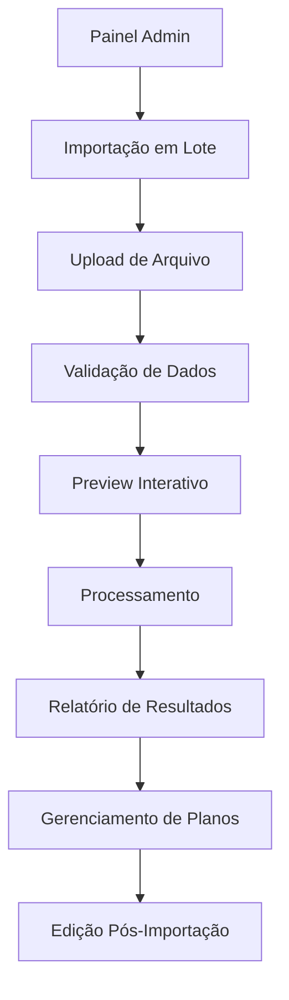

# Sistema de Importação em Lote de Empresas - PRD

## 1. Visão Geral do Produto

Sistema de importação em lote para cadastro de múltiplas empresas simultaneamente através de arquivos Excel ou CSV no painel administrativo do Portal Maria Helena. As empresas importadas são automaticamente cadastradas no plano básico, com possibilidade posterior de upgrade para plano premium.

- **Objetivo Principal**: Facilitar o cadastro massivo de empresas, reduzindo tempo e esforço manual
- **Público-Alvo**: Administradores do portal que precisam cadastrar múltiplas empresas
- **Valor de Mercado**: Aumentar eficiência operacional e acelerar o crescimento da base de empresas cadastradas

## 2. Funcionalidades Principais

### 2.1 Papéis de Usuário

| Papel | Método de Acesso | Permissões Principais |
|-------|------------------|----------------------|
| Administrador | Login admin existente | Pode importar empresas em lote, visualizar relatórios, gerenciar planos |

### 2.2 Módulos Funcionais

O sistema de importação em lote consiste das seguintes páginas principais:

1. **Página de Importação**: interface de upload, preview e validação de dados
2. **Página de Relatórios**: histórico de importações e resultados detalhados
3. **Página de Gerenciamento**: upgrade de planos e edição pós-importação

### 2.3 Detalhes das Páginas

| Página | Módulo | Descrição da Funcionalidade |
|--------|--------|----------------------------|
| Importação | Upload de Arquivo | Aceita arquivos .xlsx, .xls, .csv com drag & drop ou seleção manual |
| Importação | Validação de Dados | Verifica campos obrigatórios, formatos e duplicatas em tempo real |
| Importação | Preview Interativo | Exibe dados parseados com possibilidade de correção antes da importação |
| Importação | Processamento em Lote | Importa empresas com barra de progresso e feedback em tempo real |
| Relatórios | Histórico de Importações | Lista todas as importações realizadas com status e estatísticas |
| Relatórios | Detalhes de Resultados | Mostra sucessos, erros e avisos de cada importação específica |
| Gerenciamento | Upgrade de Planos | Interface para alterar empresas do plano básico para premium |
| Gerenciamento | Edição Pós-Importação | Permite editar dados das empresas importadas |

## 3. Fluxo Principal

### Fluxo do Administrador

1. **Acesso ao Sistema**: Login no painel administrativo
2. **Preparação do Arquivo**: Download de template Excel/CSV com campos obrigatórios
3. **Upload do Arquivo**: Seleção e upload do arquivo com dados das empresas
4. **Validação Automática**: Sistema valida dados e exibe erros/avisos
5. **Preview e Correção**: Visualização dos dados com possibilidade de ajustes
6. **Importação em Lote**: Processamento das empresas com feedback em tempo real
7. **Relatório Final**: Visualização de resultados com sucessos e falhas
8. **Gerenciamento Posterior**: Upgrade de planos e edições conforme necessário

## 4. Design da Interface

### 4.1 Estilo de Design

- **Cores Primárias**: Azul (#3B82F6) para ações principais, Verde (#10B981) para sucessos
- **Cores Secundárias**: Cinza (#6B7280) para textos, Vermelho (#EF4444) para erros
- **Estilo de Botões**: Arredondados com sombra sutil, estados hover e loading
- **Tipografia**: Inter ou similar, tamanhos 14px (corpo), 18px (títulos), 24px (cabeçalhos)
- **Layout**: Cards com bordas arredondadas, espaçamento generoso, grid responsivo
- **Ícones**: Lucide React ou Heroicons para consistência visual

### 4.2 Visão Geral das Páginas

| Página | Módulo | Elementos da Interface |
|--------|--------|------------------------|
| Importação | Área de Upload | Drag & drop zone, botão de seleção, indicador de progresso, preview de arquivo |
| Importação | Validação | Tabela de dados, badges de status, tooltips explicativos, botões de correção |
| Importação | Preview | Grid editável, filtros por status, botões de ação em lote, contador de registros |
| Relatórios | Histórico | Tabela paginada, filtros por data/status, botões de download, gráficos de estatísticas |
| Gerenciamento | Planos | Cards de empresas, toggle básico/premium, filtros por plano, ações em lote |

### 4.3 Responsividade

O sistema é projetado mobile-first com adaptação para desktop, incluindo:
- Layout em cards empilháveis para mobile
- Tabelas com scroll horizontal em telas pequenas
- Navegação por tabs em dispositivos móveis
- Otimização de touch para botões e controles

## Campos de Importação

### Campos Obrigatórios
- **Nome da Empresa**: Texto, máximo 100 caracteres
- **Categoria**: Seleção de categoria existente no sistema
- **Telefone**: Formato brasileiro (11) 99999-9999
- **Endereço**: Texto completo com rua, número, bairro
- **Descrição**: Texto, máximo 500 caracteres

### Campos Opcionais
- **Email**: Formato válido de email
- **Website**: URL válida (http/https)
- **WhatsApp**: Número no formato brasileiro
- **Horário de Funcionamento**: Texto livre ou formato estruturado
- **Imagem**: URL válida ou placeholder automático

## Validações e Regras de Negócio

### Validações Técnicas
- Verificação de formato de arquivo (Excel/CSV)
- Validação de campos obrigatórios
- Verificação de duplicatas por nome/telefone
- Validação de formatos (email, telefone, URL)
- Limite máximo de 1000 empresas por importação

### Regras de Negócio
- Empresas importadas ficam automaticamente no plano básico
- Categorias devem existir previamente no sistema
- Duplicatas são sinalizadas mas não impedem importação
- Erros críticos param o processo, avisos permitem continuidade
- Histórico de importações mantido por 90 dias