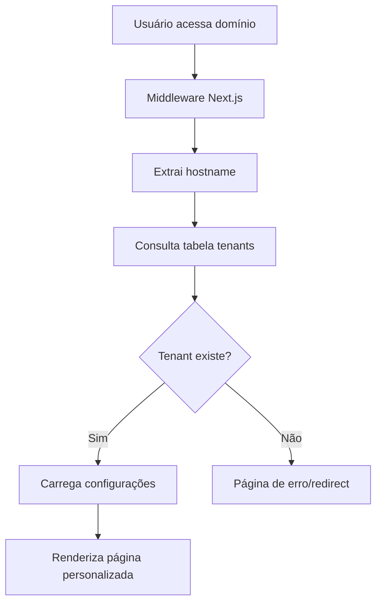

# Sistema Multi-Tenant para Portal Maria Helena

## 📋 Visão Geral

Este documento apresenta a arquitetura e implementação de um sistema multi-tenant para transformar o Portal Maria Helena em uma solução SaaS, permitindo alugar a plataforma para diferentes cidades e clientes com domínios personalizados.

## 🎯 Objetivos

- **Monetização**: Transformar a solução em produto SaaS
- **Escalabilidade**: Atender múltiplas cidades simultaneamente
- **Personalização**: Cada cliente com sua identidade visual e dados
- **Isolamento**: Segurança total entre diferentes tenants
- **Facilidade**: Gestão centralizada de todos os clientes

## 🏗️ 1. Arquitetura Multi-Tenant

### 1.1 Estratégias de Multi-tenancy

#### **Opção Recomendada: Domain-based Tenancy**
```
cliente1.com.br → Tenant: "cidade-a"
cliente2.com.br → Tenant: "cidade-b"
portal-demo.vercel.app → Tenant: "demo"
```

**Vantagens:**
- ✅ Melhor SEO para cada cliente
- ✅ Branding completo personalizado
- ✅ Facilita marketing e vendas
- ✅ Isolamento visual total

#### **Alternativa: Subdomain-based**
```
cidade-a.portalmh.com.br → Tenant: "cidade-a"
cidade-b.portalmh.com.br → Tenant: "cidade-b"
```

### 1.2 Fluxo de Identificação do Tenant



## 🗄️ 2. Estrutura do Banco de Dados Multi-Tenant

### 2.1 Tabela de Tenants

```sql
-- Tabela principal de tenants
CREATE TABLE tenants (
    id UUID PRIMARY KEY DEFAULT gen_random_uuid(),
    slug VARCHAR(50) UNIQUE NOT NULL, -- identificador único
    domain VARCHAR(255) UNIQUE NOT NULL, -- domínio personalizado
    name VARCHAR(255) NOT NULL, -- nome da cidade/cliente
    status VARCHAR(20) DEFAULT 'active' CHECK (status IN ('active', 'suspended', 'trial')),
    
    -- Configurações visuais
    logo_url TEXT,
    primary_color VARCHAR(7) DEFAULT '#3B82F6', -- hex color
    secondary_color VARCHAR(7) DEFAULT '#10B981',
    favicon_url TEXT,
    
    -- Informações da cidade
    city_name VARCHAR(255) NOT NULL,
    state VARCHAR(2) NOT NULL,
    country VARCHAR(2) DEFAULT 'BR',
    timezone VARCHAR(50) DEFAULT 'America/Sao_Paulo',
    
    -- Configurações de contato
    contact_email VARCHAR(255),
    contact_phone VARCHAR(20),
    contact_address TEXT,
    
    -- Configurações do plano
    plan_type VARCHAR(20) DEFAULT 'basic' CHECK (plan_type IN ('trial', 'basic', 'premium', 'enterprise')),
    max_empresas INTEGER DEFAULT 100,
    max_noticias INTEGER DEFAULT 50,
    max_eventos INTEGER DEFAULT 20,
    max_banners INTEGER DEFAULT 5,
    
    -- Billing
    billing_email VARCHAR(255),
    billing_cycle VARCHAR(20) DEFAULT 'monthly' CHECK (billing_cycle IN ('monthly', 'yearly')),
    billing_amount DECIMAL(10,2),
    next_billing_date TIMESTAMP WITH TIME ZONE,
    
    -- Metadados
    created_at TIMESTAMP WITH TIME ZONE DEFAULT NOW(),
    updated_at TIMESTAMP WITH TIME ZONE DEFAULT NOW(),
    created_by UUID REFERENCES auth.users(id)
);

-- Índices para performance
CREATE INDEX idx_tenants_domain ON tenants(domain);
CREATE INDEX idx_tenants_slug ON tenants(slug);
CREATE INDEX idx_tenants_status ON tenants(status);
```

### 2.2 Modificação das Tabelas Existentes

Todas as tabelas existentes precisam incluir `tenant_id`:

```sql
-- Exemplo: Modificar tabela empresas
ALTER TABLE empresas ADD COLUMN tenant_id UUID REFERENCES tenants(id);
CREATE INDEX idx_empresas_tenant ON empresas(tenant_id);

-- Exemplo: Modificar tabela noticias
ALTER TABLE noticias ADD COLUMN tenant_id UUID REFERENCES tenants(id);
CREATE INDEX idx_noticias_tenant ON noticias(tenant_id);

-- Exemplo: Modificar tabela eventos
ALTER TABLE eventos ADD COLUMN tenant_id UUID REFERENCES tenants(id);
CREATE INDEX idx_eventos_tenant ON eventos(tenant_id);

-- Exemplo: Modificar tabela banners
ALTER TABLE banners ADD COLUMN tenant_id UUID REFERENCES tenants(id);
CREATE INDEX idx_banners_tenant ON banners(tenant_id);

-- Exemplo: Modificar tabela classificados
ALTER TABLE classificados ADD COLUMN tenant_id UUID REFERENCES tenants(id);
CREATE INDEX idx_classificados_tenant ON classificados(tenant_id);
```

### 2.3 Row Level Security (RLS)

```sql
-- Habilitar RLS em todas as tabelas
ALTER TABLE empresas ENABLE ROW LEVEL SECURITY;
ALTER TABLE noticias ENABLE ROW LEVEL SECURITY;
ALTER TABLE eventos ENABLE ROW LEVEL SECURITY;
ALTER TABLE banners ENABLE ROW LEVEL SECURITY;
ALTER TABLE classificados ENABLE ROW LEVEL SECURITY;

-- Política para empresas
CREATE POLICY "tenant_isolation_empresas" ON empresas
    FOR ALL USING (
        tenant_id = (
            SELECT id FROM tenants 
            WHERE domain = current_setting('app.current_tenant_domain', true)
        )
    );

-- Política para noticias
CREATE POLICY "tenant_isolation_noticias" ON noticias
    FOR ALL USING (
        tenant_id = (
            SELECT id FROM tenants 
            WHERE domain = current_setting('app.current_tenant_domain', true)
        )
    );

-- Repetir para todas as tabelas...
```

## 🔧 3. Implementação no Next.js

### 3.1 Middleware para Detecção de Tenant

```typescript
// middleware.ts
import { NextRequest, NextResponse } from 'next/server'
import { createClient } from '@supabase/supabase-js'

const supabase = createClient(
  process.env.NEXT_PUBLIC_SUPABASE_URL!,
  process.env.SUPABASE_SERVICE_ROLE_KEY!
)

export async function middleware(request: NextRequest) {
  const hostname = request.headers.get('host') || ''
  
  // Extrair domínio (remover porta se existir)
  const domain = hostname.split(':')[0]
  
  // Buscar tenant pelo domínio
  const { data: tenant, error } = await supabase
    .from('tenants')
    .select('*')
    .eq('domain', domain)
    .eq('status', 'active')
    .single()

  if (error || !tenant) {
    // Redirecionar para página de erro ou domínio principal
    return NextResponse.redirect(new URL('/tenant-not-found', request.url))
  }

  // Adicionar informações do tenant aos headers
  const response = NextResponse.next()
  response.headers.set('x-tenant-id', tenant.id)
  response.headers.set('x-tenant-slug', tenant.slug)
  response.headers.set('x-tenant-domain', tenant.domain)
  
  return response
}

export const config = {
  matcher: [
    '/((?!api|_next/static|_next/image|favicon.ico|tenant-not-found).*)',
  ],
}
```

### 3.2 Context Provider para Tenant

```typescript
// contexts/TenantContext.tsx
import React, { createContext, useContext, useEffect, useState } from 'react'

interface TenantConfig {
  id: string
  slug: string
  domain: string
  name: string
  cityName: string
  logoUrl?: string
  primaryColor: string
  secondaryColor: string
  contactEmail?: string
  contactPhone?: string
  contactAddress?: string
}

interface TenantContextType {
  tenant: TenantConfig | null
  loading: boolean
  error: string | null
}

const TenantContext = createContext<TenantContextType>({
  tenant: null,
  loading: true,
  error: null
})

export const useTenant = () => {
  const context = useContext(TenantContext)
  if (!context) {
    throw new Error('useTenant must be used within TenantProvider')
  }
  return context
}

export const TenantProvider: React.FC<{ children: React.ReactNode }> = ({ children }) => {
  const [tenant, setTenant] = useState<TenantConfig | null>(null)
  const [loading, setLoading] = useState(true)
  const [error, setError] = useState<string | null>(null)

  useEffect(() => {
    const fetchTenantConfig = async () => {
      try {
        const response = await fetch('/api/tenant/config')
        if (!response.ok) {
          throw new Error('Failed to fetch tenant config')
        }
        const data = await response.json()
        setTenant(data)
      } catch (err) {
        setError(err instanceof Error ? err.message : 'Unknown error')
      } finally {
        setLoading(false)
      }
    }

    fetchTenantConfig()
  }, [])

  return (
    <TenantContext.Provider value={{ tenant, loading, error }}>
      {children}
    </TenantContext.Provider>
  )
}
```

### 3.3 API Route para Configuração do Tenant

```typescript
// pages/api/tenant/config.ts
import { NextApiRequest, NextApiResponse } from 'next'
import { supabase } from '../../../lib/supabase'

export default async function handler(req: NextApiRequest, res: NextApiResponse) {
  if (req.method !== 'GET') {
    return res.status(405).json({ error: 'Method not allowed' })
  }

  try {
    // Obter domínio do header
    const domain = req.headers.host?.split(':')[0] || ''
    
    // Buscar configuração do tenant
    const { data: tenant, error } = await supabase
      .from('tenants')
      .select(`
        id,
        slug,
        domain,
        name,
        city_name,
        logo_url,
        primary_color,
        secondary_color,
        contact_email,
        contact_phone,
        contact_address
      `)
      .eq('domain', domain)
      .eq('status', 'active')
      .single()

    if (error || !tenant) {
      return res.status(404).json({ error: 'Tenant not found' })
    }

    // Configurar contexto do Supabase para RLS
    await supabase.rpc('set_config', {
      parameter: 'app.current_tenant_domain',
      value: domain
    })

    res.status(200).json({
      id: tenant.id,
      slug: tenant.slug,
      domain: tenant.domain,
      name: tenant.name,
      cityName: tenant.city_name,
      logoUrl: tenant.logo_url,
      primaryColor: tenant.primary_color,
      secondaryColor: tenant.secondary_color,
      contactEmail: tenant.contact_email,
      contactPhone: tenant.contact_phone,
      contactAddress: tenant.contact_address
    })
  } catch (error) {
    console.error('Error fetching tenant config:', error)
    res.status(500).json({ error: 'Internal server error' })
  }
}
```

### 3.4 Modificação do _app.tsx

```typescript
// pages/_app.tsx
import type { AppProps } from 'next/app'
import { TenantProvider } from '../contexts/TenantContext'
import { DynamicThemeProvider } from '../contexts/ThemeContext'
import '../styles/globals.css'

export default function App({ Component, pageProps }: AppProps) {
  return (
    <TenantProvider>
      <DynamicThemeProvider>
        <Component {...pageProps} />
      </DynamicThemeProvider>
    </TenantProvider>
  )
}
```

## 🎨 4. Personalização Visual por Tenant

### 4.1 Dynamic Theme Provider

```typescript
// contexts/ThemeContext.tsx
import React, { createContext, useContext, useEffect } from 'react'
import { useTenant } from './TenantContext'

interface ThemeContextType {
  primaryColor: string
  secondaryColor: string
  logoUrl?: string
}

const ThemeContext = createContext<ThemeContextType>({
  primaryColor: '#3B82F6',
  secondaryColor: '#10B981'
})

export const useTheme = () => useContext(ThemeContext)

export const DynamicThemeProvider: React.FC<{ children: React.ReactNode }> = ({ children }) => {
  const { tenant } = useTenant()

  useEffect(() => {
    if (tenant) {
      // Aplicar cores CSS customizadas
      document.documentElement.style.setProperty('--primary-color', tenant.primaryColor)
      document.documentElement.style.setProperty('--secondary-color', tenant.secondaryColor)
      
      // Atualizar favicon se disponível
      if (tenant.faviconUrl) {
        const favicon = document.querySelector('link[rel="icon"]') as HTMLLinkElement
        if (favicon) {
          favicon.href = tenant.faviconUrl
        }
      }
      
      // Atualizar título da página
      document.title = `Portal ${tenant.cityName}`
    }
  }, [tenant])

  const themeValue = {
    primaryColor: tenant?.primaryColor || '#3B82F6',
    secondaryColor: tenant?.secondaryColor || '#10B981',
    logoUrl: tenant?.logoUrl
  }

  return (
    <ThemeContext.Provider value={themeValue}>
      {children}
    </ThemeContext.Provider>
  )
}
```

### 4.2 Componente Header Dinâmico

```typescript
// components/DynamicHeader.tsx
import React from 'react'
import Image from 'next/image'
import { useTenant } from '../contexts/TenantContext'
import { useTheme } from '../contexts/ThemeContext'

const DynamicHeader: React.FC = () => {
  const { tenant } = useTenant()
  const { logoUrl } = useTheme()

  if (!tenant) return null

  return (
    <header className="bg-white shadow-lg">
      <div className="container mx-auto px-4 py-4">
        <div className="flex items-center justify-between">
          <div className="flex items-center space-x-4">
            {logoUrl ? (
              <Image
                src={logoUrl}
                alt={`Logo ${tenant.cityName}`}
                width={120}
                height={60}
                className="h-12 w-auto"
              />
            ) : (
              <div 
                className="h-12 w-32 rounded flex items-center justify-center text-white font-bold"
                style={{ backgroundColor: 'var(--primary-color)' }}
              >
                {tenant.cityName}
              </div>
            )}
            <div>
              <h1 className="text-2xl font-bold text-gray-900">
                Portal {tenant.cityName}
              </h1>
              <p className="text-sm text-gray-600">
                Seu guia completo da cidade
              </p>
            </div>
          </div>
        </div>
      </div>
    </header>
  )
}

export default DynamicHeader
```

## 🔐 5. Configuração de Domínios na Vercel

### 5.1 Configuração Automática via API

```typescript
// scripts/add-domain-to-vercel.ts
import { VercelApiClient } from '@vercel/sdk'

const vercel = new VercelApiClient({
  bearerToken: process.env.VERCEL_TOKEN!
})

export async function addDomainToVercel(domain: string, tenantId: string) {
  try {
    // Adicionar domínio ao projeto
    await vercel.domains.createDomain({
      name: domain,
      projectId: process.env.VERCEL_PROJECT_ID!
    })

    // Configurar DNS records se necessário
    await vercel.domains.createDomainRecord({
      domain,
      type: 'CNAME',
      name: '@',
      value: 'cname.vercel-dns.com'
    })

    console.log(`Domínio ${domain} adicionado com sucesso para tenant ${tenantId}`)
    return true
  } catch (error) {
    console.error('Erro ao adicionar domínio:', error)
    return false
  }
}
```

### 5.2 Configuração Manual

1. **No painel da Vercel:**
   - Ir em Settings > Domains
   - Adicionar cada domínio personalizado
   - Configurar DNS records

2. **Configuração DNS do cliente:**
   ```
   Tipo: CNAME
   Nome: @
   Valor: cname.vercel-dns.com
   ```

## 🛠️ 6. Painel de Administração Multi-Tenant

### 6.1 Página de Gestão de Tenants

```typescript
// pages/admin/tenants/index.tsx
import React, { useState, useEffect } from 'react'
import { supabase } from '../../../lib/supabase'

interface Tenant {
  id: string
  slug: string
  domain: string
  name: string
  cityName: string
  status: string
  planType: string
  createdAt: string
}

const TenantsManagement: React.FC = () => {
  const [tenants, setTenants] = useState<Tenant[]>([])
  const [loading, setLoading] = useState(true)

  useEffect(() => {
    fetchTenants()
  }, [])

  const fetchTenants = async () => {
    try {
      const { data, error } = await supabase
        .from('tenants')
        .select('*')
        .order('created_at', { ascending: false })

      if (error) throw error
      setTenants(data || [])
    } catch (error) {
      console.error('Erro ao buscar tenants:', error)
    } finally {
      setLoading(false)
    }
  }

  const updateTenantStatus = async (tenantId: string, status: string) => {
    try {
      const { error } = await supabase
        .from('tenants')
        .update({ status })
        .eq('id', tenantId)

      if (error) throw error
      
      // Atualizar lista local
      setTenants(prev => 
        prev.map(tenant => 
          tenant.id === tenantId ? { ...tenant, status } : tenant
        )
      )
    } catch (error) {
      console.error('Erro ao atualizar status:', error)
    }
  }

  if (loading) {
    return <div className="p-8">Carregando tenants...</div>
  }

  return (
    <div className="p-8">
      <div className="flex justify-between items-center mb-8">
        <h1 className="text-3xl font-bold">Gestão de Tenants</h1>
        <button className="bg-blue-600 text-white px-4 py-2 rounded-lg hover:bg-blue-700">
          Novo Tenant
        </button>
      </div>

      <div className="bg-white rounded-lg shadow overflow-hidden">
        <table className="min-w-full divide-y divide-gray-200">
          <thead className="bg-gray-50">
            <tr>
              <th className="px-6 py-3 text-left text-xs font-medium text-gray-500 uppercase tracking-wider">
                Cidade
              </th>
              <th className="px-6 py-3 text-left text-xs font-medium text-gray-500 uppercase tracking-wider">
                Domínio
              </th>
              <th className="px-6 py-3 text-left text-xs font-medium text-gray-500 uppercase tracking-wider">
                Plano
              </th>
              <th className="px-6 py-3 text-left text-xs font-medium text-gray-500 uppercase tracking-wider">
                Status
              </th>
              <th className="px-6 py-3 text-left text-xs font-medium text-gray-500 uppercase tracking-wider">
                Ações
              </th>
            </tr>
          </thead>
          <tbody className="bg-white divide-y divide-gray-200">
            {tenants.map((tenant) => (
              <tr key={tenant.id}>
                <td className="px-6 py-4 whitespace-nowrap">
                  <div>
                    <div className="text-sm font-medium text-gray-900">
                      {tenant.cityName}
                    </div>
                    <div className="text-sm text-gray-500">
                      {tenant.name}
                    </div>
                  </div>
                </td>
                <td className="px-6 py-4 whitespace-nowrap">
                  <a 
                    href={`https://${tenant.domain}`}
                    target="_blank"
                    rel="noopener noreferrer"
                    className="text-blue-600 hover:text-blue-800"
                  >
                    {tenant.domain}
                  </a>
                </td>
                <td className="px-6 py-4 whitespace-nowrap">
                  <span className="px-2 inline-flex text-xs leading-5 font-semibold rounded-full bg-blue-100 text-blue-800">
                    {tenant.planType}
                  </span>
                </td>
                <td className="px-6 py-4 whitespace-nowrap">
                  <span className={`px-2 inline-flex text-xs leading-5 font-semibold rounded-full ${
                    tenant.status === 'active' 
                      ? 'bg-green-100 text-green-800'
                      : tenant.status === 'trial'
                      ? 'bg-yellow-100 text-yellow-800'
                      : 'bg-red-100 text-red-800'
                  }`}>
                    {tenant.status}
                  </span>
                </td>
                <td className="px-6 py-4 whitespace-nowrap text-sm font-medium">
                  <div className="flex space-x-2">
                    <button 
                      onClick={() => updateTenantStatus(tenant.id, 
                        tenant.status === 'active' ? 'suspended' : 'active'
                      )}
                      className={`px-3 py-1 rounded text-xs ${
                        tenant.status === 'active'
                          ? 'bg-red-100 text-red-700 hover:bg-red-200'
                          : 'bg-green-100 text-green-700 hover:bg-green-200'
                      }`}
                    >
                      {tenant.status === 'active' ? 'Suspender' : 'Ativar'}
                    </button>
                    <button className="px-3 py-1 bg-blue-100 text-blue-700 rounded text-xs hover:bg-blue-200">
                      Editar
                    </button>
                  </div>
                </td>
              </tr>
            ))}
          </tbody>
        </table>
      </div>
    </div>
  )
}

export default TenantsManagement
```

## 💰 7. Sistema de Billing e Monetização

### 7.1 Estrutura de Preços Sugerida

```typescript
// lib/pricing.ts
export const PRICING_PLANS = {
  trial: {
    name: 'Trial',
    price: 0,
    duration: 30, // dias
    features: {
      maxEmpresas: 20,
      maxNoticias: 10,
      maxEventos: 5,
      maxBanners: 2,
      customDomain: false,
      support: 'email'
    }
  },
  basic: {
    name: 'Básico',
    price: 197, // R$ por mês
    features: {
      maxEmpresas: 100,
      maxNoticias: 50,
      maxEventos: 20,
      maxBanners: 5,
      customDomain: true,
      support: 'email'
    }
  },
  premium: {
    name: 'Premium',
    price: 397, // R$ por mês
    features: {
      maxEmpresas: 500,
      maxNoticias: 200,
      maxEventos: 100,
      maxBanners: 15,
      customDomain: true,
      support: 'priority'
    }
  },
  enterprise: {
    name: 'Enterprise',
    price: 797, // R$ por mês
    features: {
      maxEmpresas: -1, // ilimitado
      maxNoticias: -1,
      maxEventos: -1,
      maxBanners: -1,
      customDomain: true,
      support: 'dedicated'
    }
  }
}
```

### 7.2 Integração com Gateway de Pagamento

```typescript
// lib/billing.ts
import Stripe from 'stripe'

const stripe = new Stripe(process.env.STRIPE_SECRET_KEY!, {
  apiVersion: '2023-10-16'
})

export async function createSubscription(tenantId: string, planType: string, customerEmail: string) {
  try {
    // Criar customer no Stripe
    const customer = await stripe.customers.create({
      email: customerEmail,
      metadata: {
        tenantId
      }
    })

    // Criar subscription
    const subscription = await stripe.subscriptions.create({
      customer: customer.id,
      items: [{
        price: getPriceIdForPlan(planType)
      }],
      payment_behavior: 'default_incomplete',
      payment_settings: {
        save_default_payment_method: 'on_subscription'
      },
      expand: ['latest_invoice.payment_intent']
    })

    // Atualizar tenant com informações de billing
    await supabase
      .from('tenants')
      .update({
        stripe_customer_id: customer.id,
        stripe_subscription_id: subscription.id,
        plan_type: planType,
        billing_amount: PRICING_PLANS[planType].price,
        next_billing_date: new Date(subscription.current_period_end * 1000)
      })
      .eq('id', tenantId)

    return {
      subscriptionId: subscription.id,
      clientSecret: subscription.latest_invoice.payment_intent.client_secret
    }
  } catch (error) {
    console.error('Erro ao criar subscription:', error)
    throw error
  }
}

function getPriceIdForPlan(planType: string): string {
  const priceIds = {
    basic: process.env.STRIPE_PRICE_BASIC!,
    premium: process.env.STRIPE_PRICE_PREMIUM!,
    enterprise: process.env.STRIPE_PRICE_ENTERPRISE!
  }
  return priceIds[planType]
}
```

## 🚀 8. Implementação Passo a Passo

### Fase 1: Preparação do Banco (Semana 1)
1. ✅ Criar tabela `tenants`
2. ✅ Adicionar `tenant_id` em todas as tabelas
3. ✅ Implementar RLS policies
4. ✅ Migrar dados existentes para tenant padrão

### Fase 2: Core Multi-tenant (Semana 2)
1. ✅ Implementar middleware de detecção
2. ✅ Criar TenantContext
3. ✅ Modificar APIs para suportar tenants
4. ✅ Testar isolamento de dados

### Fase 3: Personalização (Semana 3)
1. ✅ Implementar ThemeProvider dinâmico
2. ✅ Criar componentes personalizáveis
3. ✅ Sistema de upload de logos
4. ✅ Configuração de cores por tenant

### Fase 4: Administração (Semana 4)
1. ✅ Painel de gestão de tenants
2. ✅ Formulário de criação de novos tenants
3. ✅ Sistema de monitoramento
4. ✅ Relatórios por tenant

### Fase 5: Billing e Produção (Semana 5)
1. ✅ Integração com Stripe
2. ✅ Sistema de trial e upgrades
3. ✅ Configuração de domínios na Vercel
4. ✅ Deploy e testes finais

## 🔒 9. Considerações de Segurança

### 9.1 Isolamento de Dados
- ✅ RLS policies obrigatórias em todas as tabelas
- ✅ Validação de tenant_id em todas as queries
- ✅ Middleware de segurança para verificar acesso
- ✅ Logs de auditoria por tenant

### 9.2 Autenticação por Tenant
```typescript
// lib/auth-tenant.ts
export async function signInWithTenant(email: string, password: string, tenantId: string) {
  const { data, error } = await supabase.auth.signInWithPassword({
    email,
    password
  })

  if (error) throw error

  // Verificar se usuário pertence ao tenant
  const { data: userTenant, error: tenantError } = await supabase
    .from('user_tenants')
    .select('*')
    .eq('user_id', data.user.id)
    .eq('tenant_id', tenantId)
    .single()

  if (tenantError || !userTenant) {
    await supabase.auth.signOut()
    throw new Error('Usuário não autorizado para este tenant')
  }

  return data
}
```

## 📊 10. Monitoramento e Analytics

### 10.1 Métricas por Tenant
```typescript
// lib/tenant-analytics.ts
export async function getTenantMetrics(tenantId: string, period: string = '30d') {
  const { data, error } = await supabase
    .from('tenant_metrics')
    .select('*')
    .eq('tenant_id', tenantId)
    .gte('date', getDateRange(period))

  return {
    totalEmpresas: data?.reduce((sum, d) => sum + d.empresas_count, 0) || 0,
    totalNoticias: data?.reduce((sum, d) => sum + d.noticias_count, 0) || 0,
    totalEventos: data?.reduce((sum, d) => sum + d.eventos_count, 0) || 0,
    pageViews: data?.reduce((sum, d) => sum + d.page_views, 0) || 0,
    uniqueVisitors: data?.reduce((sum, d) => sum + d.unique_visitors, 0) || 0
  }
}
```

## 💡 11. Próximos Passos e Melhorias

### 11.1 Funcionalidades Avançadas
- 🔄 **White-label completo**: Remoção total da marca Portal Maria Helena
- 📱 **App mobile**: Versão mobile personalizada por tenant
- 🤖 **IA personalizada**: Chatbot com conhecimento específico da cidade
- 📧 **Email marketing**: Sistema de newsletters por tenant
- 🛒 **E-commerce**: Marketplace local integrado

### 11.2 Integrações
- 📍 **Google My Business**: Sincronização automática
- 📱 **WhatsApp Business**: API integrada
- 💳 **PIX**: Pagamentos locais
- 🗺️ **Mapas**: Integração com mapas locais

## 📋 12. Checklist de Implementação

### Banco de Dados
- [ ] Criar tabela `tenants`
- [ ] Adicionar `tenant_id` em todas as tabelas existentes
- [ ] Implementar RLS policies
- [ ] Criar índices de performance
- [ ] Migrar dados existentes

### Backend/API
- [ ] Implementar middleware de detecção de tenant
- [ ] Modificar todas as APIs para suportar multi-tenancy
- [ ] Criar APIs de gestão de tenants
- [ ] Implementar sistema de billing
- [ ] Configurar webhooks do Stripe

### Frontend
- [ ] Criar TenantContext e ThemeProvider
- [ ] Modificar componentes para serem dinâmicos
- [ ] Implementar painel de administração
- [ ] Criar formulários de configuração
- [ ] Testar responsividade

### DevOps
- [ ] Configurar domínios na Vercel
- [ ] Implementar CI/CD para multi-tenant
- [ ] Configurar monitoramento
- [ ] Implementar backups por tenant
- [ ] Documentar processo de deploy

### Testes
- [ ] Testes de isolamento de dados
- [ ] Testes de performance com múltiplos tenants
- [ ] Testes de segurança
- [ ] Testes de billing
- [ ] Testes de domínios personalizados

## 🎯 Conclusão

A implementação de um sistema multi-tenant transformará o Portal Maria Helena em uma solução SaaS escalável e lucrativa. Com a arquitetura proposta, você poderá:

- **Monetizar** a solução com mensalidades recorrentes
- **Escalar** para centenas de cidades simultaneamente
- **Personalizar** completamente cada instalação
- **Manter** segurança e isolamento total entre clientes
- **Gerenciar** tudo de forma centralizada

**Investimento estimado:** 4-6 semanas de desenvolvimento
**ROI esperado:** A partir do 3º cliente, o sistema já se paga
**Potencial de receita:** R$ 50.000+ por mês com 100 cidades

Esta é uma oportunidade única de transformar seu projeto local em um negócio nacional! 🚀