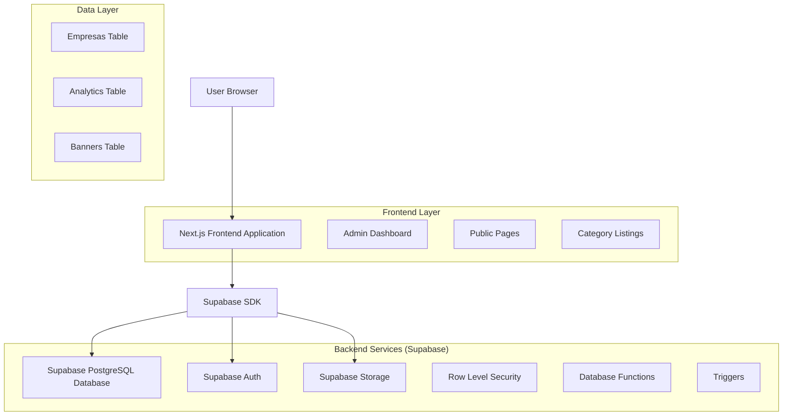
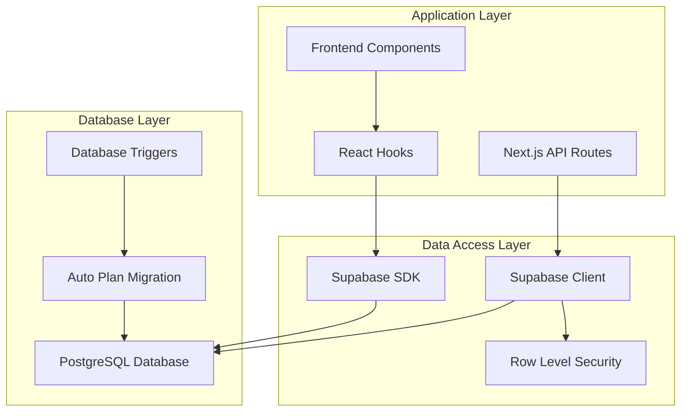
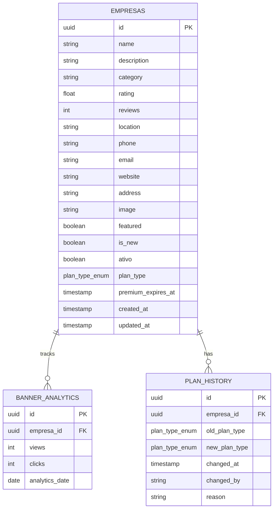

# Sistema de Planos Premium - Arquitetura Técnica

## 1. Architecture design



## 2. Technology Description

- Frontend: Next.js@13 + React@18 + TypeScript + Tailwind CSS@3
- Backend: Supabase (PostgreSQL + Auth + Storage + Real-time)
- Database: PostgreSQL (via Supabase)
- Authentication: Supabase Auth
- Deployment: Vercel

## 3. Route definitions

| Route | Purpose |
|-------|---------|
| /admin/empresas | Página de administração de empresas com gestão de planos |
| /guia/[id] | Página individual para empresas premium |
| /guia/categoria/[categoria] | Listagem de empresas básicas por categoria |
| /guia/index | Página principal do guia com todas as empresas |
| /admin/relatorios | Dashboard de relatórios de planos (futuro) |

## 4. API definitions

### 4.1 Core API

**Empresas com Planos**
```
GET /api/admin/empresas
```

Response:
| Param Name | Param Type | Description |
|-----------|-------------|-------------|
| empresas | Array<Empresa> | Lista de empresas com informações de plano |
| total | number | Total de empresas |
| premium_count | number | Quantidade de empresas premium ativas |
| basic_count | number | Quantidade de empresas básicas |

**Atualizar Plano da Empresa**
```
PUT /api/admin/empresas/[id]/plano
```

Request:
| Param Name | Param Type | isRequired | Description |
|-----------|-------------|-------------|-------------|
| plan_type | 'premium' \| 'basic' | true | Tipo do plano |
| premium_expires_at | string | false | Data de expiração (ISO string, obrigatório para premium) |

Response:
| Param Name | Param Type | Description |
|-----------|-------------|-------------|
| success | boolean | Status da operação |
| empresa | Empresa | Dados atualizados da empresa |

**Listar Empresas por Categoria (Básicas)**
```
GET /api/guia/categoria/[categoria]
```

Response:
| Param Name | Param Type | Description |
|-----------|-------------|-------------|
| empresas | Array<Empresa> | Empresas básicas da categoria |
| categoria | string | Nome da categoria |
| total | number | Total de empresas na categoria |

## 5. Server architecture diagram



## 6. Data model

### 6.1 Data model definition



### 6.2 Data Definition Language

**Migração para Adicionar Campos de Plano**
```sql
-- Criar enum para tipos de plano
CREATE TYPE plan_type_enum AS ENUM ('basic', 'premium');

-- Adicionar campos na tabela empresas
ALTER TABLE empresas 
ADD COLUMN plan_type plan_type_enum DEFAULT 'basic' NOT NULL,
ADD COLUMN premium_expires_at TIMESTAMP WITH TIME ZONE;

-- Criar índices para performance
CREATE INDEX idx_empresas_plan_type ON empresas(plan_type);
CREATE INDEX idx_empresas_premium_expires ON empresas(premium_expires_at) WHERE plan_type = 'premium';
CREATE INDEX idx_empresas_category_plan ON empresas(category, plan_type);

-- Criar tabela de histórico de planos
CREATE TABLE plan_history (
    id UUID PRIMARY KEY DEFAULT gen_random_uuid(),
    empresa_id UUID REFERENCES empresas(id) ON DELETE CASCADE,
    old_plan_type plan_type_enum,
    new_plan_type plan_type_enum NOT NULL,
    changed_at TIMESTAMP WITH TIME ZONE DEFAULT NOW(),
    changed_by VARCHAR(255),
    reason TEXT,
    created_at TIMESTAMP WITH TIME ZONE DEFAULT NOW()
);

-- Índices para histórico
CREATE INDEX idx_plan_history_empresa_id ON plan_history(empresa_id);
CREATE INDEX idx_plan_history_changed_at ON plan_history(changed_at DESC);

-- Função para migração automática de planos expirados
CREATE OR REPLACE FUNCTION migrate_expired_premium_plans()
RETURNS void AS $$
BEGIN
    -- Atualizar empresas premium expiradas para básico
    UPDATE empresas 
    SET plan_type = 'basic',
        premium_expires_at = NULL,
        updated_at = NOW()
    WHERE plan_type = 'premium' 
    AND premium_expires_at < NOW();
    
    -- Registrar no histórico
    INSERT INTO plan_history (empresa_id, old_plan_type, new_plan_type, reason)
    SELECT id, 'premium', 'basic', 'Automatic migration - plan expired'
    FROM empresas 
    WHERE plan_type = 'basic' 
    AND updated_at >= NOW() - INTERVAL '1 minute';
END;
$$ LANGUAGE plpgsql;

-- Trigger para executar migração diariamente
CREATE OR REPLACE FUNCTION trigger_plan_migration()
RETURNS trigger AS $$
BEGIN
    PERFORM migrate_expired_premium_plans();
    RETURN NULL;
END;
$$ LANGUAGE plpgsql;

-- Políticas RLS para planos
ALTER TABLE empresas ENABLE ROW LEVEL SECURITY;

-- Política para leitura pública (empresas ativas)
CREATE POLICY "Public can view active empresas" ON empresas
    FOR SELECT USING (ativo = true);

-- Política para administradores (acesso total)
CREATE POLICY "Admins can manage all empresas" ON empresas
    FOR ALL USING (
        EXISTS (
            SELECT 1 FROM auth.users 
            WHERE auth.users.id = auth.uid() 
            AND auth.users.email LIKE '%@admin.%'
        )
    );

-- Política para histórico de planos (apenas admins)
ALTER TABLE plan_history ENABLE ROW LEVEL SECURITY;

CREATE POLICY "Admins can view plan history" ON plan_history
    FOR SELECT USING (
        EXISTS (
            SELECT 1 FROM auth.users 
            WHERE auth.users.id = auth.uid() 
            AND auth.users.email LIKE '%@admin.%'
        )
    );

-- Grants para roles
GRANT SELECT ON empresas TO anon;
GRANT ALL PRIVILEGES ON empresas TO authenticated;
GRANT SELECT ON plan_history TO authenticated;

-- Dados iniciais para teste
INSERT INTO empresas (name, description, category, plan_type, premium_expires_at) VALUES
('Empresa Premium Teste', 'Empresa com plano premium ativo', 'Tecnologia', 'premium', NOW() + INTERVAL '30 days'),
('Empresa Básica Teste', 'Empresa com plano básico', 'Comércio', 'basic', NULL);
```

## 7. Implementation Checklist

### 7.1 Database Migration
- [ ] Criar migração para adicionar campos plan_type e premium_expires_at
- [ ] Implementar função de migração automática de planos expirados
- [ ] Configurar políticas RLS para novos campos
- [ ] Criar índices para performance

### 7.2 Frontend Components
- [ ] Atualizar interface Empresa no TypeScript
- [ ] Criar componente PlanBadge para exibir tipo de plano
- [ ] Atualizar formulário de cadastro de empresas
- [ ] Implementar filtros por tipo de plano
- [ ] Criar página de listagem por categoria

### 7.3 API Endpoints
- [ ] Atualizar endpoints de empresas para incluir campos de plano
- [ ] Criar endpoint para listagem por categoria
- [ ] Implementar validações de plano
- [ ] Adicionar logs de mudanças de plano

### 7.4 Business Logic
- [ ] Implementar validação de data de expiração
- [ ] Criar sistema de notificações de expiração
- [ ] Implementar migração automática de planos
- [ ] Adicionar relatórios de planos

### 7.5 Testing & Deployment
- [ ] Testes unitários para componentes de plano
- [ ] Testes de integração para migração automática
- [ ] Testes de performance para consultas com novos índices
- [ ] Deploy em ambiente de produção