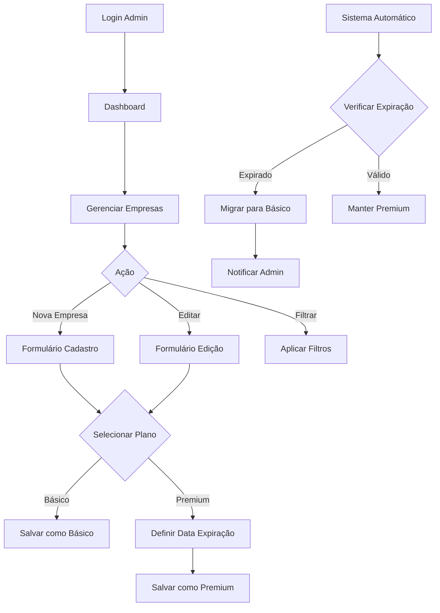

# Sistema de Planos Premium - Wireframes e Especificações de UI

## 1. Página de Administração de Empresas - Formulário Atualizado

### 1.1 Layout do Formulário

```
┌─────────────────────────────────────────────────────────────┐
│ CADASTRO/EDIÇÃO DE EMPRESA                                  │
├─────────────────────────────────────────────────────────────┤
│                                                             │
│ Nome da Empresa: [________________________]                │
│                                                             │
│ Descrição: [_________________________________]              │
│           [_________________________________]              │
│                                                             │
│ Categoria: [Dropdown ▼]                                    │
│                                                             │
│ ┌─── CONFIGURAÇÕES DE PLANO ─────────────────────────────┐  │
│ │                                                        │  │
│ │ Tipo de Plano: ○ Básico  ● Premium                    │  │
│ │                                                        │  │
│ │ [Premium Selecionado]                                  │  │
│ │ Data de Expiração: [DD/MM/AAAA] 📅                    │  │
│ │ ⚠️ Obrigatório para planos premium                     │  │
│ │                                                        │  │
│ └────────────────────────────────────────────────────────┘  │
│                                                             │
│ Telefone: [________________________]                       │
│ Email: [________________________]                          │
│ Website: [________________________]                        │
│ Endereço: [________________________]                       │
│                                                             │
│ [Cancelar]                              [Salvar Empresa]    │
└─────────────────────────────────────────────────────────────┘
```

### 1.2 Estados do Formulário

**Estado Básico:**
- Radio button "Básico" selecionado
- Campo de data de expiração oculto
- Cor do card: Verde claro (#f0fdf4)

**Estado Premium:**
- Radio button "Premium" selecionado
- Campo de data de expiração visível e obrigatório
- Validação em tempo real da data
- Cor do card: Azul claro (#eff6ff)

## 2. Página de Administração - Listagem com Badges

### 2.1 Layout da Listagem

```
┌─────────────────────────────────────────────────────────────┐
│ GERENCIAR EMPRESAS                                          │
├─────────────────────────────────────────────────────────────┤
│                                                             │
│ [🔍 Buscar...] [Categoria ▼] [Plano ▼] [+ Nova Empresa]    │
│                                                             │
│ ┌─────────────────────────────────────────────────────────┐ │
│ │ Nome              │ Categoria  │ Plano    │ Status │ Ações│ │
│ ├─────────────────────────────────────────────────────────┤ │
│ │ Empresa A         │ Tecnologia │ 👑 PREMIUM│ ✅ Ativo│ ⚙️ │ │
│ │ (Expira: 15/12/24)│            │          │        │    │ │
│ ├─────────────────────────────────────────────────────────┤ │
│ │ Empresa B         │ Comércio   │ 🏷️ BÁSICO │ ✅ Ativo│ ⚙️ │ │
│ ├─────────────────────────────────────────────────────────┤ │
│ │ Empresa C         │ Serviços   │ ⚠️ EXPIRADO│ ❌ Inativo│ ⚙️ │ │
│ │ (Expirou: 01/11/24)│           │          │        │    │ │
│ └─────────────────────────────────────────────────────────┘ │
│                                                             │
│ [← Anterior] Página 1 de 5 [Próxima →]                     │
└─────────────────────────────────────────────────────────────┘
```

### 2.2 Especificações dos Badges

**Badge Premium Ativo:**
- Cor: Azul (#2563eb)
- Ícone: 👑 (coroa)
- Texto: "PREMIUM"
- Hover: Tooltip com data de expiração

**Badge Básico:**
- Cor: Verde (#16a34a)
- Ícone: 🏷️ (tag)
- Texto: "BÁSICO"

**Badge Expirado:**
- Cor: Vermelho (#dc2626)
- Ícone: ⚠️ (alerta)
- Texto: "EXPIRADO"
- Ação: Botão "Renovar" no hover

## 3. Página de Listagem por Categoria (Empresas Básicas)

### 3.1 Layout da Página

```
┌─────────────────────────────────────────────────────────────┐
│ GUIA COMERCIAL - CATEGORIA: TECNOLOGIA                     │
├─────────────────────────────────────────────────────────────┤
│                                                             │
│ [A] [B] [C] [D] [E] [F] [G] [H] [I] [J] [K] [L] [M]        │
│ [N] [O] [P] [Q] [R] [S] [T] [U] [V] [W] [X] [Y] [Z]        │
│                                                             │
│ 📊 15 empresas encontradas                                  │
│                                                             │
│ ┌─────────────────┐ ┌─────────────────┐ ┌─────────────────┐ │
│ │ 🏢 Empresa A    │ │ 🏢 Empresa B    │ │ 🏢 Empresa C    │ │
│ │                 │ │                 │ │                 │ │
│ │ Desenvolvimento │ │ Consultoria TI  │ │ Suporte Técnico │ │
│ │ Web             │ │                 │ │                 │ │
│ │                 │ │ ⭐⭐⭐⭐⭐ (4.8)  │ │ ⭐⭐⭐⭐☆ (4.2)  │ │
│ │ 📞 (44) 9999... │ │ 📞 (44) 8888... │ │ 📞 (44) 7777... │ │
│ │ 📧 contato@...  │ │ 📧 info@...     │ │ 📧 suporte@...  │ │
│ │                 │ │                 │ │                 │ │
│ │ [Ver Detalhes]  │ │ [Ver Detalhes]  │ │ [Ver Detalhes]  │ │
│ └─────────────────┘ └─────────────────┘ └─────────────────┘ │
│                                                             │
│ ┌─────────────────┐ ┌─────────────────┐ ┌─────────────────┐ │
│ │ 🏢 Empresa D    │ │ 🏢 Empresa E    │ │ 🏢 Empresa F    │ │
│ │ ...             │ │ ...             │ │ ...             │ │
│ └─────────────────┘ └─────────────────┘ └─────────────────┘ │
│                                                             │
│ [← Voltar ao Guia]                                          │
└─────────────────────────────────────────────────────────────┘
```

### 3.2 Especificações dos Cards

**Card de Empresa Básica:**
- Tamanho: 300px x 250px
- Padding: 16px
- Border: 1px solid #e5e7eb
- Border-radius: 8px
- Hover: Sombra elevada + border azul
- Conteúdo: Nome, descrição (2 linhas), rating, telefone, email, botão

## 4. Página Individual Premium

### 4.1 Layout da Página

```
┌─────────────────────────────────────────────────────────────┐
│ 👑 EMPRESA PREMIUM - TECNOLOGIA AVANÇADA LTDA              │
├─────────────────────────────────────────────────────────────┤
│                                                             │
│ ┌─────────────────┐ ┌─────────────────────────────────────┐ │
│ │     LOGO DA     │ │ 📞 (44) 3025-1234                   │ │
│ │     EMPRESA     │ │ 📧 contato@tecnologiaavancada.com   │ │
│ │                 │ │ 🌐 www.tecnologiaavancada.com       │ │
│ │   [200x150px]   │ │ 📍 Rua das Flores, 123 - Centro    │ │
│ │                 │ │                                     │ │
│ └─────────────────┘ │ ⭐⭐⭐⭐⭐ (4.9) - 127 avaliações    │ │
│                     │                                     │ │
│                     │ [📞 LIGAR AGORA] [📧 ENVIAR EMAIL]  │ │
│                     └─────────────────────────────────────┘ │
│                                                             │
│ ┌─────────────────────────────────────────────────────────┐ │
│ │ SOBRE A EMPRESA                                         │ │
│ │                                                         │ │
│ │ Empresa especializada em desenvolvimento de software    │ │
│ │ corporativo, com mais de 10 anos de experiência no     │ │
│ │ mercado. Oferecemos soluções completas em tecnologia   │ │
│ │ para empresas de todos os portes...                     │ │
│ └─────────────────────────────────────────────────────────┘ │
│                                                             │
│ ┌─────────────────┐ ┌─────────────────────────────────────┐ │
│ │ GALERIA         │ │ LOCALIZAÇÃO                         │ │
│ │                 │ │                                     │ │
│ │ [IMG] [IMG]     │ │ [        MAPA INTEGRADO        ]    │ │
│ │ [IMG] [IMG]     │ │ [      GOOGLE MAPS/OSM         ]    │ │
│ │                 │ │ [                              ]    │ │
│ │ [Ver Todas]     │ │                                     │ │
│ └─────────────────┘ └─────────────────────────────────────┘ │
│                                                             │
│ ┌─────────────────────────────────────────────────────────┐ │
│ │ SERVIÇOS OFERECIDOS                                     │ │
│ │                                                         │ │
│ │ • Desenvolvimento Web                                   │ │
│ │ • Aplicativos Mobile                                    │ │
│ │ • Consultoria em TI                                     │ │
│ │ • Suporte Técnico                                       │ │
│ └─────────────────────────────────────────────────────────┘ │
│                                                             │
│ [← Voltar ao Guia]                    [⚠️ Reportar Erro]   │
└─────────────────────────────────────────────────────────────┘
```

## 5. Fluxo de Navegação Detalhado

### 5.1 Fluxo do Usuário Final

```mermaid
graph TD
    A[Homepage] --> B[Guia Comercial]
    B --> C{Buscar Empresa}
    C -->|Empresa Premium| D[Página Individual /guia/[id]]
    C -->|Categoria| E[Listagem Categoria /guia/categoria/[cat]]
    E --> F{Selecionar Empresa}
    F -->|Empresa Básica| G[Modal/Popup com Detalhes]
    F -->|Ver Mais| H[Página Simples de Detalhes]
    
    D --> I[Ações de Contato]
    G --> I
    H --> I
    
    I --> J[Ligar/Email/WhatsApp]
```

### 5.2 Fluxo do Administrador



## 6. Especificações Técnicas de UI

### 6.1 Componentes React

**PlanBadge.tsx**
```typescript
interface PlanBadgeProps {
  planType: 'premium' | 'basic' | 'expired';
  expiresAt?: string;
  size?: 'sm' | 'md' | 'lg';
}
```

**PlanSelector.tsx**
```typescript
interface PlanSelectorProps {
  value: 'premium' | 'basic';
  onChange: (plan: 'premium' | 'basic') => void;
  expiresAt?: Date;
  onExpiresAtChange?: (date: Date) => void;
}
```

**CategoryListing.tsx**
```typescript
interface CategoryListingProps {
  categoria: string;
  empresas: Empresa[];
  alphabetFilter?: string;
}
```

### 6.2 Estados de Loading e Erro

**Loading States:**
- Skeleton cards durante carregamento
- Spinner para ações de salvamento
- Progress bar para uploads

**Error States:**
- Toast notifications para erros
- Inline validation para formulários
- Fallback UI para falhas de carregamento

### 6.3 Responsividade

**Desktop (>1024px):**
- Grid de 3 colunas para cards
- Sidebar fixa para filtros
- Formulários em 2 colunas

**Tablet (768px-1024px):**
- Grid de 2 colunas para cards
- Sidebar colapsável
- Formulários em 1 coluna

**Mobile (<768px):**
- Lista vertical de cards
- Menu hamburger
- Formulários empilhados
- Botões de ação fixos no bottom